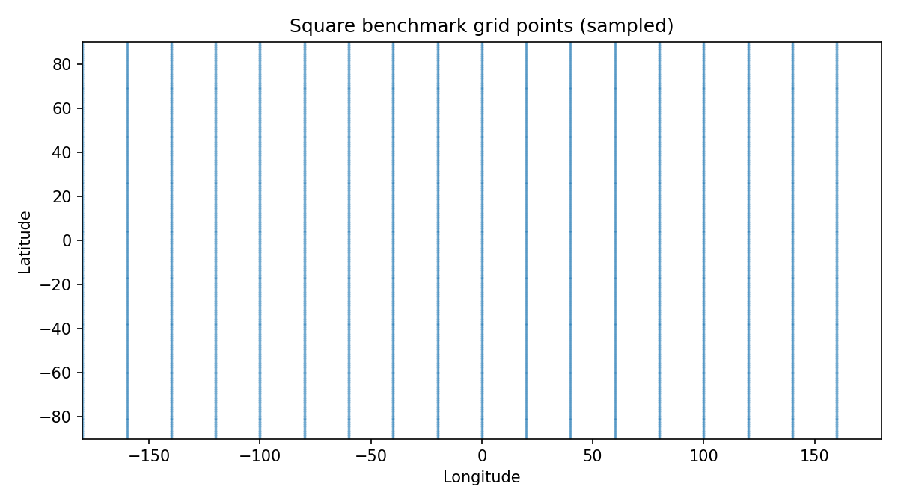

# Build square benchmark grid

## Question
Create the first benchmark square grid from the cleaned environmental tables.

## Input data
- `data/processed/benchmark_tables/spring_wind_clean.csv`

## Method
- read the cleaned benchmark wind table
- infer coordinate spacing from the unique longitude and latitude values
- create a square-grid geometry table from the unique `(lon, lat)` pairs
- save a small summary table and a quick-look figure

## Key results
- square grid rows: **64800**
- longitude range: **-180.0 to 179.0**
- latitude range: **-89.5 to 89.5**
- inferred longitude spacing: **1.0°**
- inferred latitude spacing: **1.0°**

## Outputs
- grid table: `data/processed/grids/square_grid_from_benchmark.csv`
- summary table: `results/tables/build_square_grid_summary.csv`
- figure: `results/figures/build_square_grid_points.png`

## Quick-look figure

## Interpretation
The benchmark square grid has now been reconstructed directly from the cleaned environmental table. It is a global 1° x 1° lat-lon support grid and will serve as the square-grid side of the first benchmark comparison.

## Next step
Build the first H3 benchmark grid at resolution 3 and compare its geometry to the square-grid benchmark.
