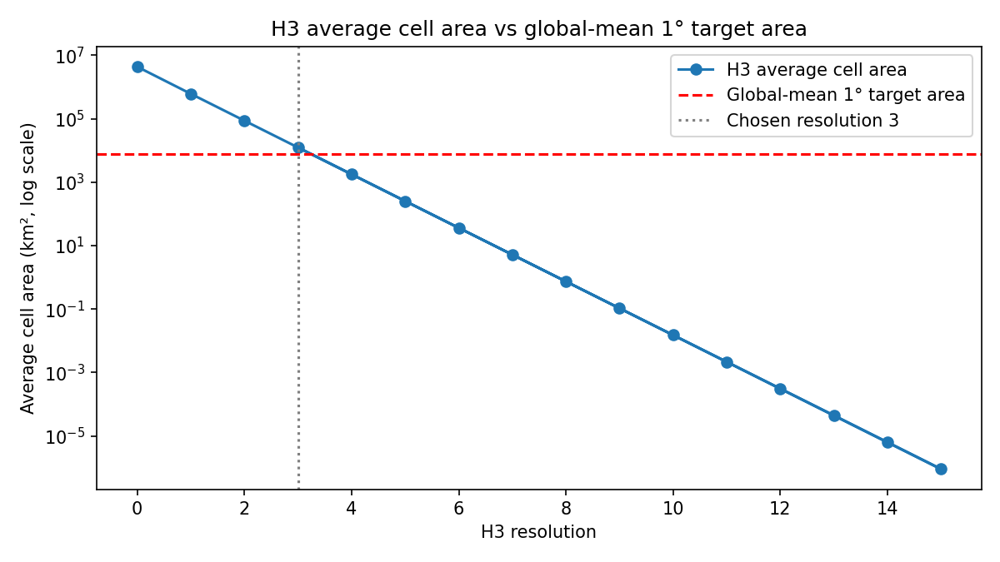

# Choose H3 resolution

## Question
Choose an H3 resolution that is roughly comparable to the benchmark 1° global lat-lon grid.

## Input data
- benchmark assumption: 1° x 1° global lat-lon support
- H3 average cell areas for resolutions 0 to 15

## Method
- estimate the global-mean area of a 1° x 1° cell using a spherical Earth approximation
- compare that target against H3 average hexagon area at each standard resolution
- choose the closest standard H3 resolution in global-mean area terms

## Key results
- target global-mean 1° area: **7871.39 km²**
- selected H3 resolution: **3**
- average H3 area at that resolution: **12393.43 km²**
- absolute difference: **4522.05 km²**

## Outputs
- comparison table: `data/processed/grids/h3_resolution_comparison.csv`
- summary table: `results/tables/04_choose_h3_resolution_summary.csv`
- figure: `results/figures/04_choose_h3_resolution_area_comparison.png`

## Quick-look figure

## Interpretation
The benchmark target lies between H3 resolutions 3 and 4. Resolution 3 is the closest standard match in global-mean area terms, but it is still only an approximate comparison target rather than an exact equivalent of the 1° benchmark grid.

## Next step
Build the first H3 benchmark grid at resolution 3 and compare its geometry directly with the square-grid benchmark.
