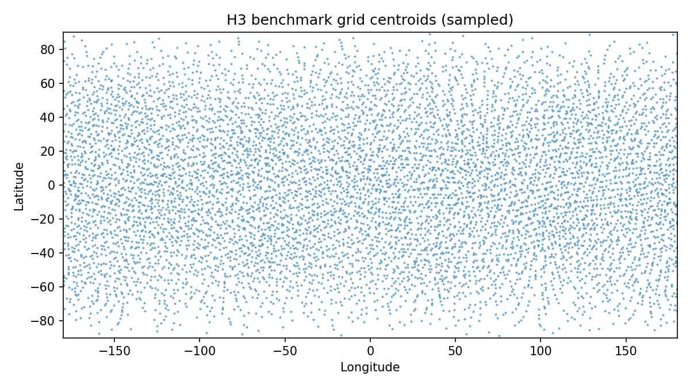
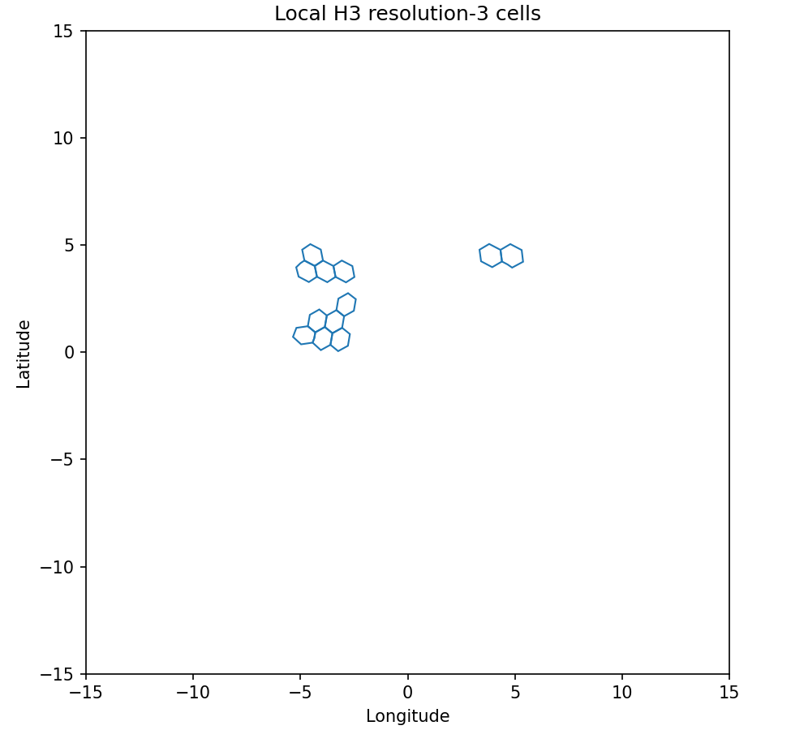

# Build H3 benchmark grid

## Question
Create the first H3 benchmark grid from the cleaned environmental benchmark support.

## Input data
- `data/processed/benchmark_tables/spring_wind_clean.csv`
- agreed H3 resolution: **3**

## Method
- read the cleaned benchmark wind table
- convert benchmark point centers to H3 cells at resolution 3
- keep unique H3 cells only
- compute simple centroid and average-area metadata
- save a clean H3 grid table

## Key results
- H3 grid rows: **38849**
- selected resolution: **3**
- average H3 hex area: **12393.43 km²**
- longitude range: **-179.996 to 179.998**
- latitude range: **-89.607 to 89.619**

## Outputs
- grid table: `data/processed/grids/h3_grid_res3_from_benchmark.csv`
- summary table: `results/tables/05_build_h3_grid_summary.csv`
- figures:
  - `results/figures/05_build_h3_grid_points.png`
  - `results/figures/05_build_h3_grid_local_cells.png`

## Quick-look figures

## Interpretation
The first H3 benchmark grid now exists as a clean project artifact. This gives us the hex-grid side of the benchmark geometry, although environmental aggregation and graph construction still remain to be implemented.

## Next step
Compare the square and H3 benchmark grids more directly, then start assigning environmental values onto the H3 support.
