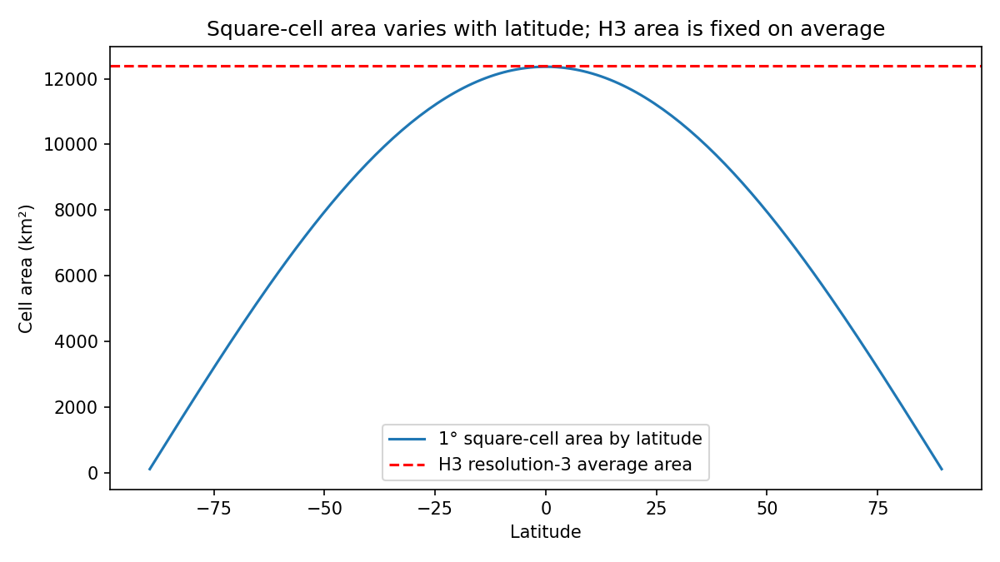
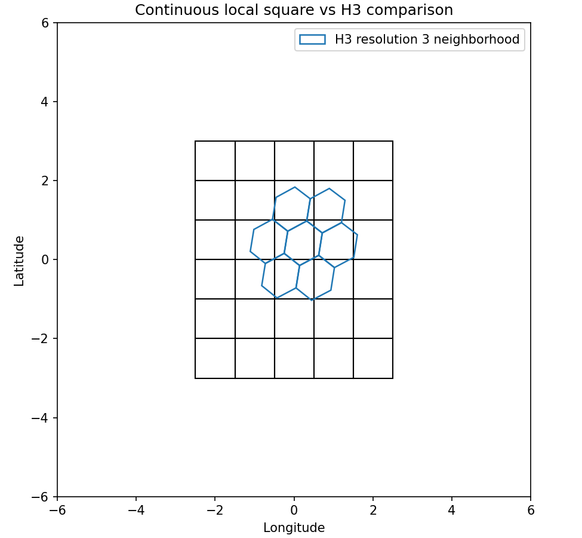

# Compare square and H3 grids

## Question
How different are the square and H3 benchmark grids at a basic geometric level?

## Input data
- `data/processed/grids/square_grid_from_benchmark.csv`
- `data/processed/grids/h3_grid_res3_from_benchmark.csv`

## Method
- summarize square-grid and H3-grid cell counts
- estimate square-cell area as a function of latitude on a sphere
- compare that with the average H3 cell area at resolution 3
- visualize both the latitude dependence of square-cell area and a small local overlap of the two grid types

## Key results
- square-grid rows: **64800**
- H3-grid rows: **38849**
- square-grid mean cell area: **7871.39 km²**
- square-grid min to max area: **107.90 to 12363.72 km²**
- H3 average cell area: **12393.43 km²**
- H3 / square mean area ratio: **1.574**

## Outputs
- summary table: `results/tables/06_compare_square_h3_grids_summary.csv`
- figures:
  - `results/figures/06_compare_square_h3_area_by_latitude.png`
  - `results/figures/06_compare_square_h3_local_overlap.png`

## Quick-look figures

## Interpretation
The two benchmark grids are comparable only in a rough sense. The square-grid cell area varies strongly with latitude, whereas the H3 grid uses cells with a much more stable characteristic area. This confirms that the square-versus-H3 comparison is inherently approximate, but still scientifically useful as a controlled geometric comparison.

## Next step
Start assigning environmental values from the cleaned benchmark tables onto the H3 grid so the two grid supports can be compared under the same environmental fields.
