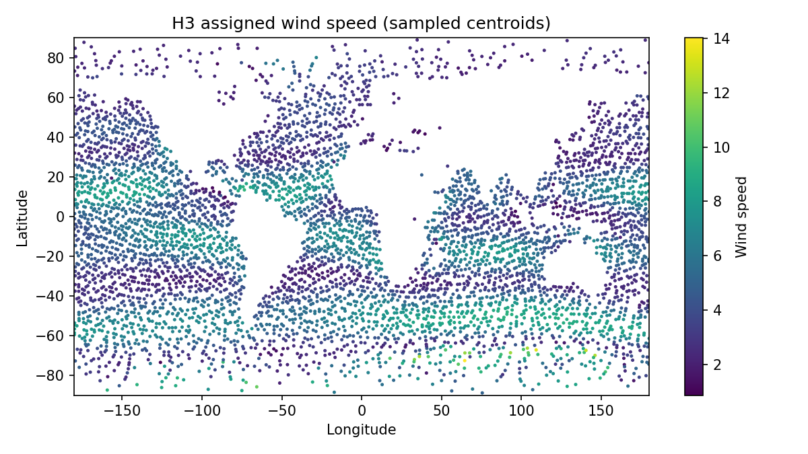
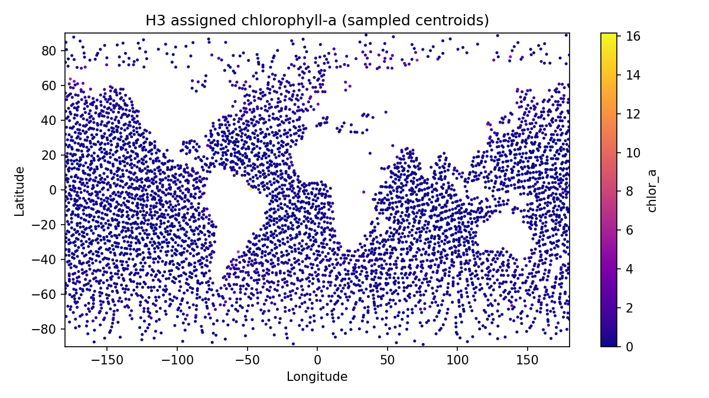

# Assign environment to H3

## Question
Assign the benchmark environmental values from the 1° support to the H3 grid using the agreed prototype method.

## Input data
- `data/processed/benchmark_tables/spring_wind_clean.csv`
- `data/processed/benchmark_tables/spring_chla_clean.csv`
- `data/processed/grids/h3_grid_res3_from_benchmark.csv`

## Method
- use the centroid of each H3 cell
- find the nearest benchmark point in the 1° environmental tables
- assign wind and chlorophyll values from that nearest benchmark point
- use `u10` and `v10` as the primary wind variables

## Key results
- output rows: **38849**
- missing `u10`: **11633**
- missing `v10`: **11633**
- missing `speed`: **11633**
- missing `chlor_a`: **11633**
- wind-speed range: **0.372 to 14.472**
- chlorophyll-a range: **0.000000 to 16.155304**

## Outputs
- environmental table: `data/processed/grids/h3_environment_res3.csv`
- summary table: `results/tables/07_assign_environment_to_h3_summary.csv`
- figures:
  - `results/figures/07_h3_assigned_wind_speed.png`
  - `results/figures/07_h3_assigned_chla.png`

## Quick-look figures

## Interpretation
The H3 grid now carries environmental values from the benchmark support using the agreed nearest-neighbor centroid sampling rule. This gives us a complete first prototype environmental layer on the hex grid without leaving empty cells.

## Next step
Compare the square-grid and H3-grid environmental fields directly, then begin constructing movement costs on the H3 support.
