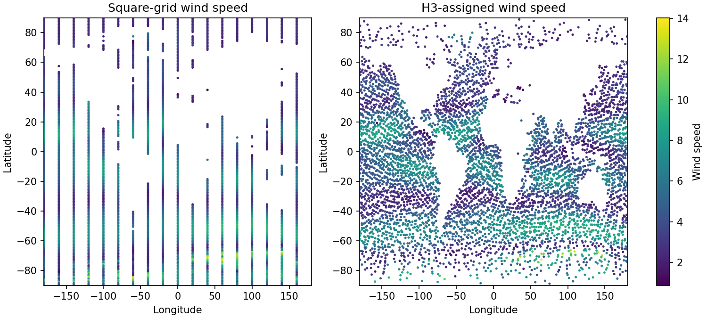
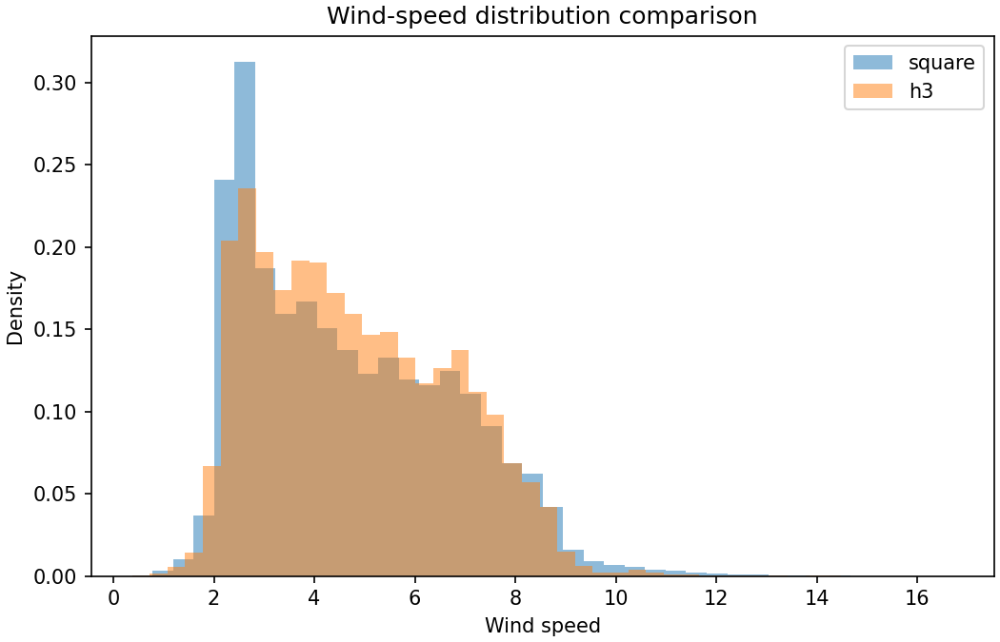
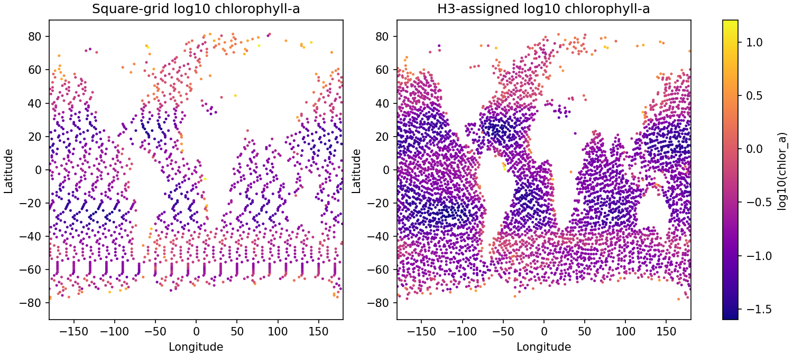
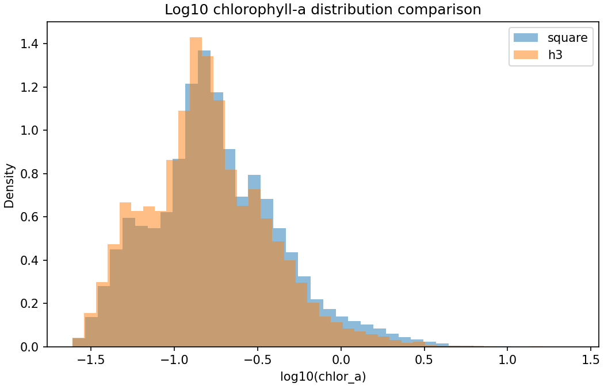

# Compare square and H3 environmental fields

## Question
How similar are the square-grid and H3-grid environmental fields after the first H3 environmental assignment step?

## Input data
- `data/processed/benchmark_tables/spring_wind_clean.csv`
- `data/processed/benchmark_tables/spring_chla_clean.csv`
- `data/processed/grids/h3_environment_res3.csv`

## Method
- compare simple summary statistics for square-grid and H3-grid fields
- compare wind-speed maps and wind-speed distributions
- compare chlorophyll-a on a log scale, since that is the more informative diagnostic view

## Outputs
- summary table: `results/tables/08_compare_square_h3_environment_summary.csv`
- figures:
  - `results/figures/08_compare_wind_maps.png`
  - `results/figures/08_compare_wind_hist.png`
  - `results/figures/08_compare_chla_log_maps.png`
  - `results/figures/08_compare_chla_log_hist.png`

## Quick-look figures

## Interpretation
This report checks whether the first H3 environmental assignment preserves the broad structure of the benchmark fields closely enough for a first cost-construction prototype. Wind is inspected on its raw scale, while chlorophyll is inspected mainly on the log scale.

## Next step
If the square-grid and H3-grid fields look sufficiently similar, begin the first cost-construction step on the H3 support.
