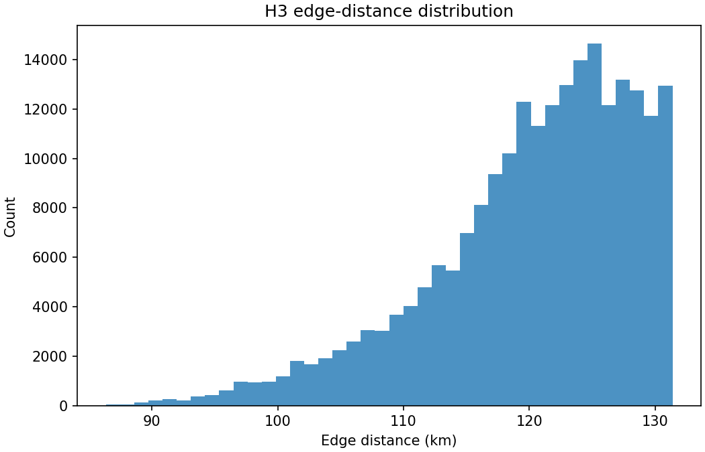
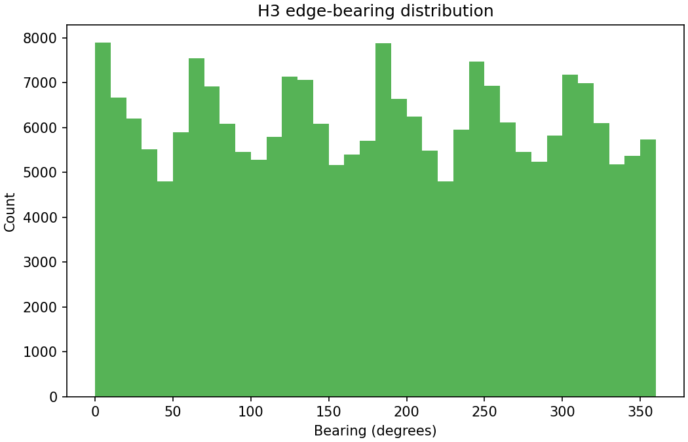
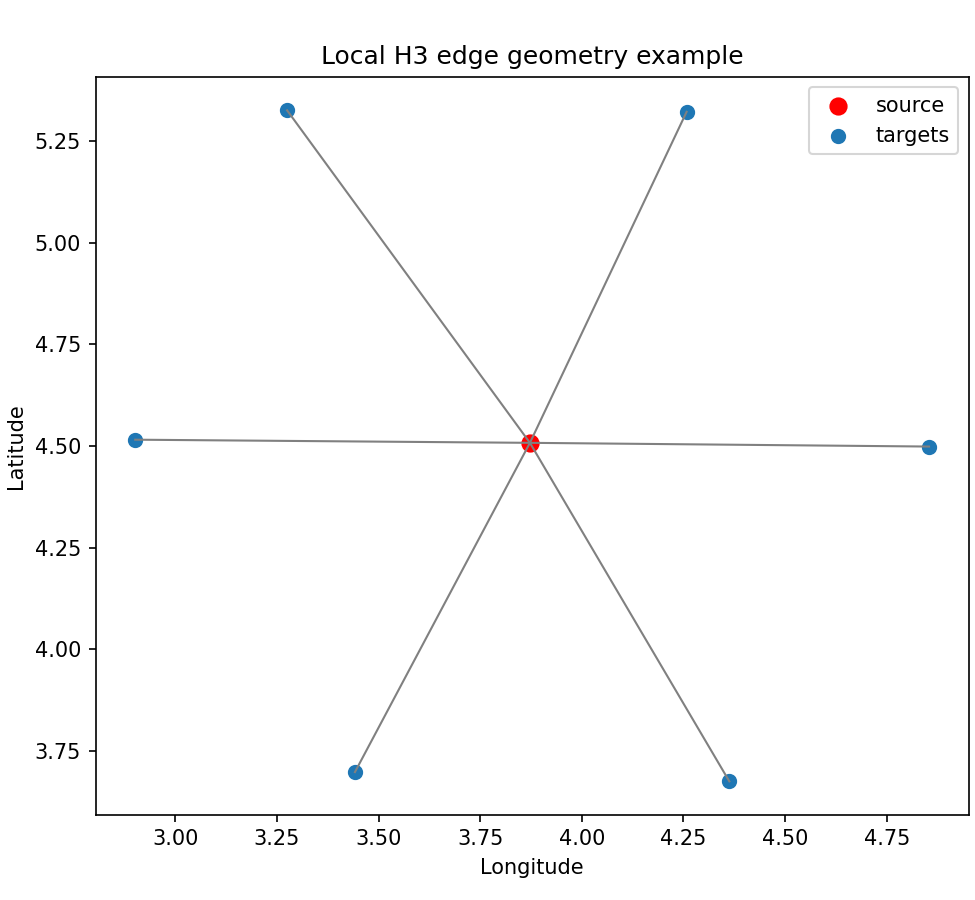

# Build H3 edge geometry

## Question
What does the directed neighbor-edge geometry of the H3 grid look like before environmental movement components are attached?

## Input data
- `data/processed/grids/h3_grid_res3_from_benchmark.csv`

## Method
- read the H3 grid table
- identify neighboring H3 cells for each source cell
- keep only source-target edges where both cells are in the benchmark H3 grid
- compute great-circle edge distance and initial movement bearing for each directed edge
- save the resulting edge-geometry table for later environmental and cost construction

## Key results
- edge rows: **221150**
- unique source cells: **38849**
- mean edges per source: **5.69**
- edge distance range: **86.34 to 131.38 km**
- mean edge distance: **120.23 km**
- bearing range: **0.05 to 359.97 degrees**

## Outputs
- edge table: `data/processed/grids/h3_edge_geometry_res3.csv`
- summary table: `results/tables/09_build_h3_edge_geometry_summary.csv`
- example edges: `results/tables/09_build_h3_edge_geometry_example_edges.csv`
- figures:
  - `results/figures/09_h3_edge_distance_hist.png`
  - `results/figures/09_h3_edge_bearing_hist.png`
  - `results/figures/09_h3_edge_local_example.png`

## Quick-look figures

## Interpretation
This step creates the first truly graph-based object in the sequel: a directed H3 edge table with explicit geometry. That is the right foundation for rebuilding the old directional movement logic transparently in Python. The next step can now attach wind and food information to each directed edge and begin constructing the cost components themselves.

## Points to watch
- H3 neighbor-edge distances are not identical everywhere, so using true edge distance really is a methodological change relative to the old constant per-step distance penalty
- the bearing distribution should look broad and plausible; any strong artifacts here would warn us about geometry problems before cost construction

## Next step
Attach environmental quantities to these directed edges and compute the first raw movement components: parallel wind, crosswind, true edge distance, and food.
