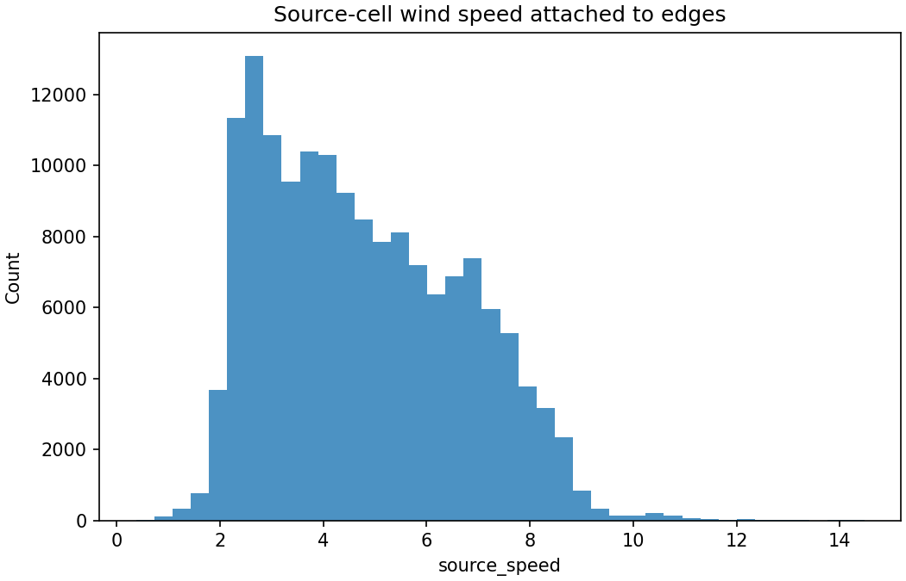
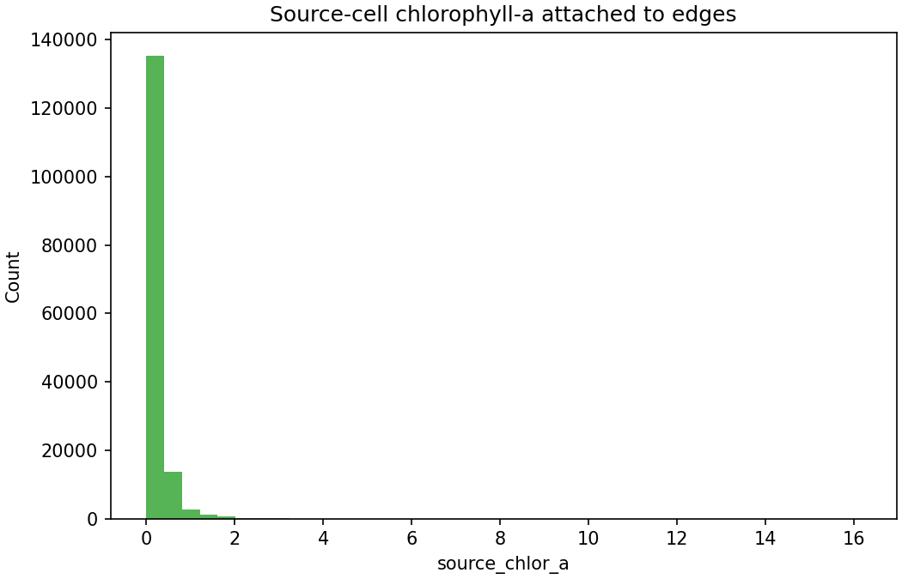
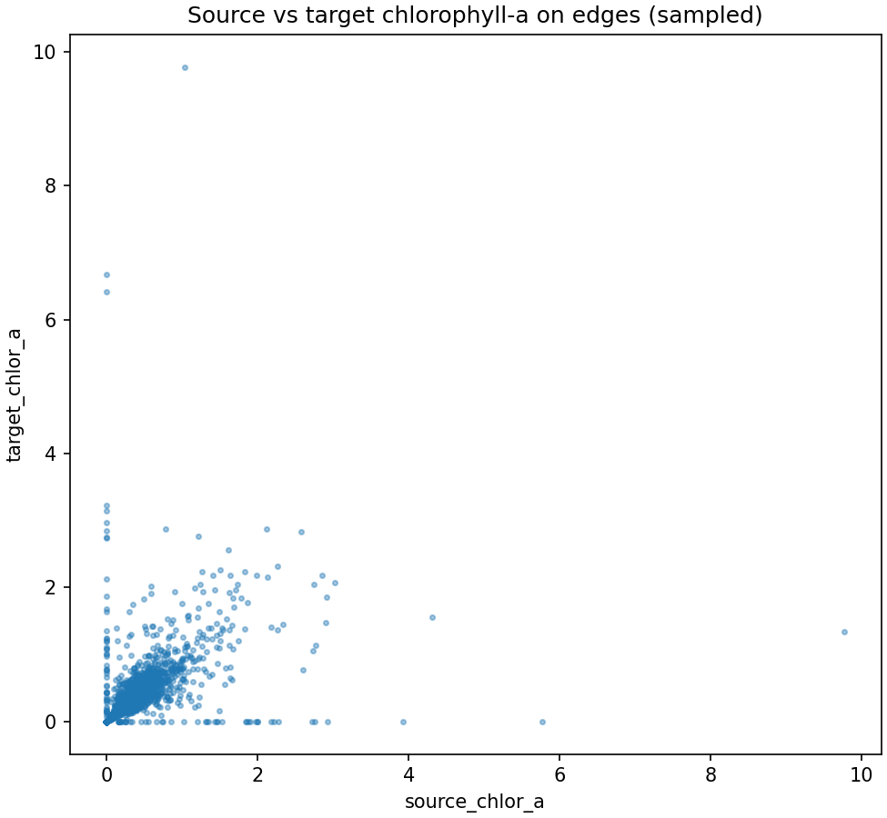

# Attach environment to H3 edges

## Question
What does the directed H3 edge table look like once environmental values are attached to each source-target transition?

## Input data
- `data/processed/grids/h3_edge_geometry_res3.csv`
- `data/processed/grids/h3_environment_res3.csv`

## Method
- attach source-cell wind and chlorophyll values to each directed edge
- attach target-cell chlorophyll values as well, so source-based and target-based food formulations can both be inspected later
- keep the step transparent and separate from actual cost construction

## Key results
- output rows: **221150**
- missing `source_u10`: **66638**
- missing `source_v10`: **66638**
- missing `source_speed`: **66638**
- missing `source_chlor_a`: **66638**
- missing `target_chlor_a`: **66638**
- source wind-speed range: **0.372 to 14.472**
- source chlorophyll-a range: **0.000000 to 16.155304**

## Outputs
- enriched edge table: `data/processed/grids/h3_edge_environment_res3.csv`
- summary table: `results/tables/10_attach_environment_to_h3_edges_summary.csv`
- example rows: `results/tables/10_attach_environment_to_h3_edges_example_rows.csv`
- figures:
  - `results/figures/10_edge_source_wind_speed_hist.png`
  - `results/figures/10_edge_source_chla_hist.png`
  - `results/figures/10_edge_source_vs_target_chla.png`

## Quick-look figures

## Interpretation
This step gives us the first fully enriched directed edge table: every source-target movement now has explicit geometry plus attached environmental context. That means the next cost-construction step can be fully transparent, because it can work directly from one inspectable table rather than from hidden joins or implicit lookups.

## Points to watch
- source and target chlorophyll are now both available, but the current project decision is to follow the published 2025 food logic first
- any remaining missing values would have been a serious warning sign at this stage, because they would propagate directly into the cost components

## Next step
Compute the raw H3 cost components on directed edges: parallel wind, crosswind, true edge distance, and food cost using the published chlorophyll treatment.
