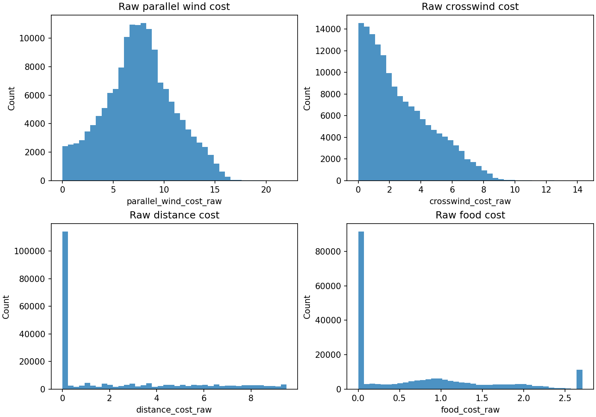
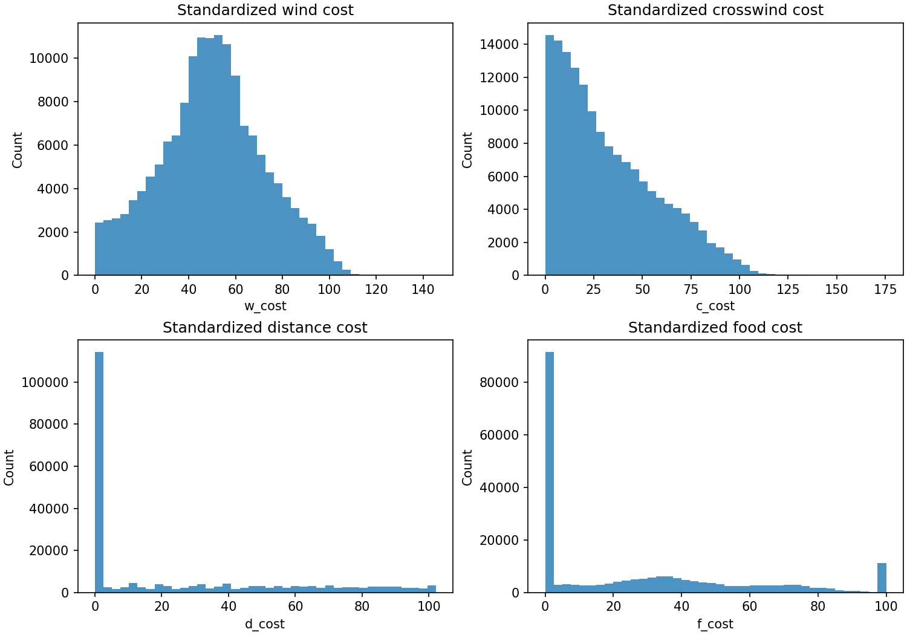
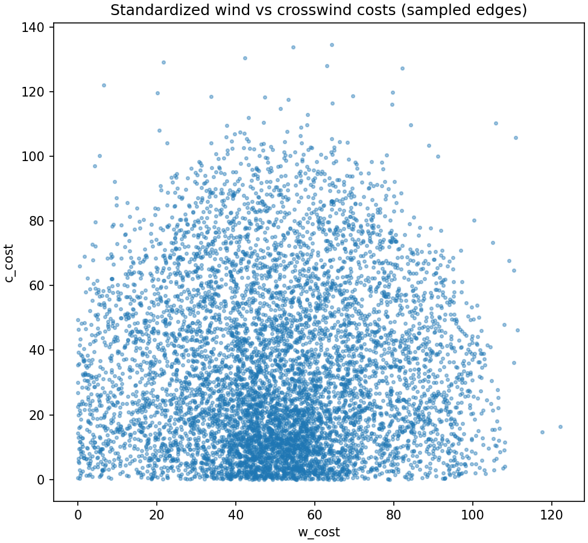
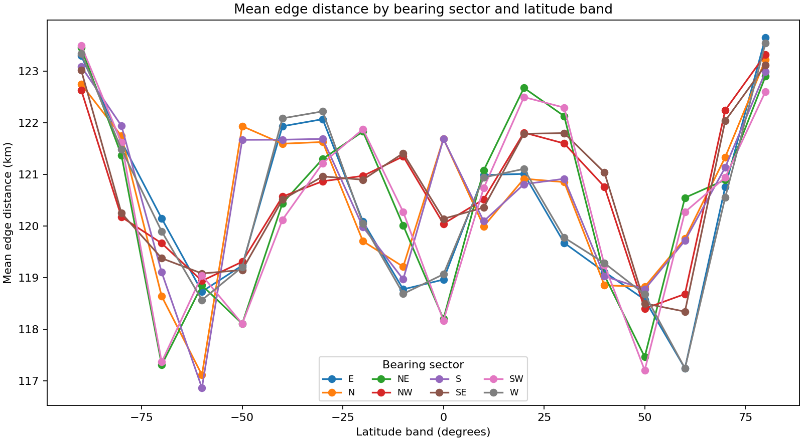
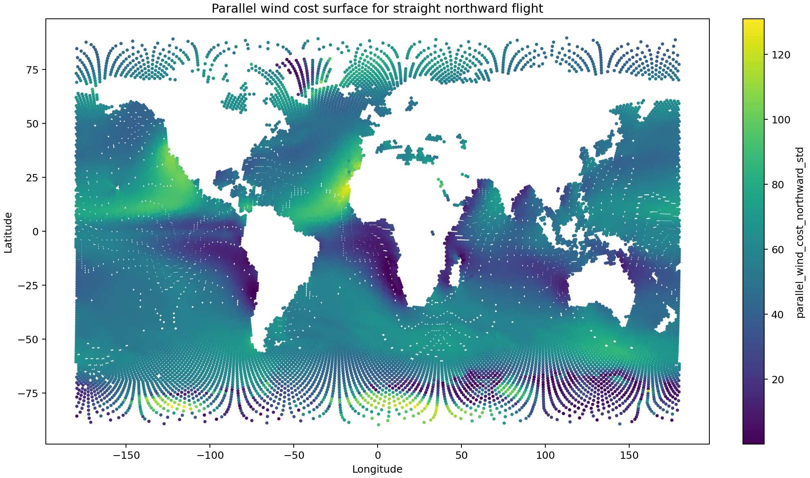
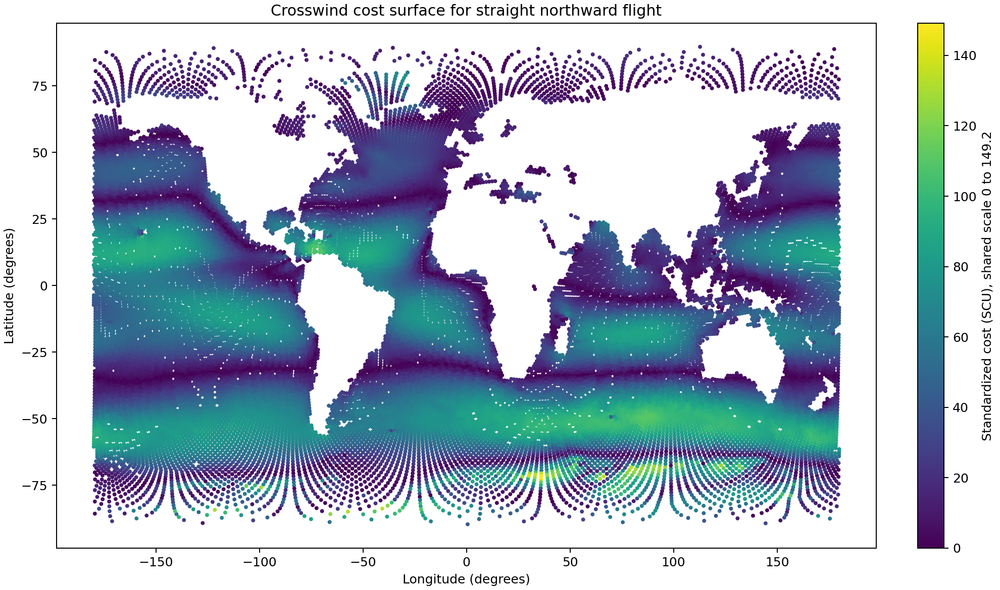
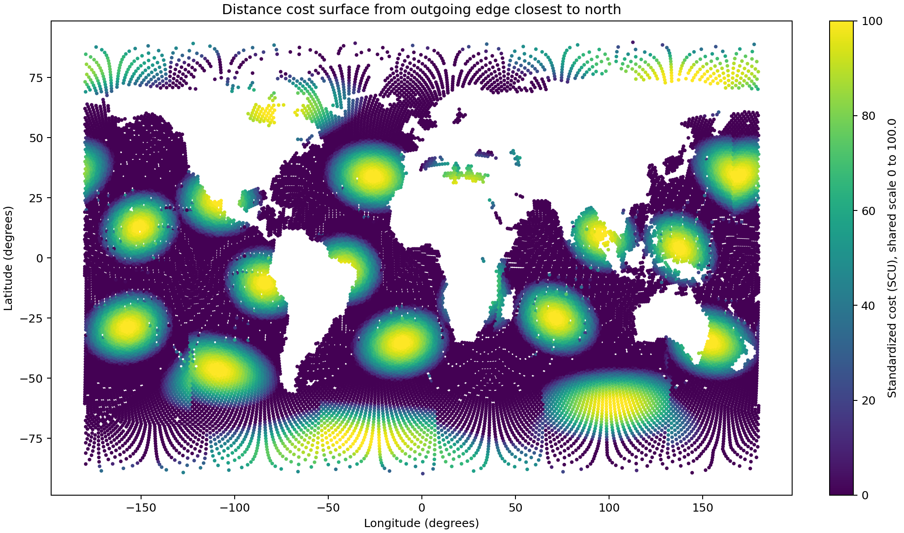
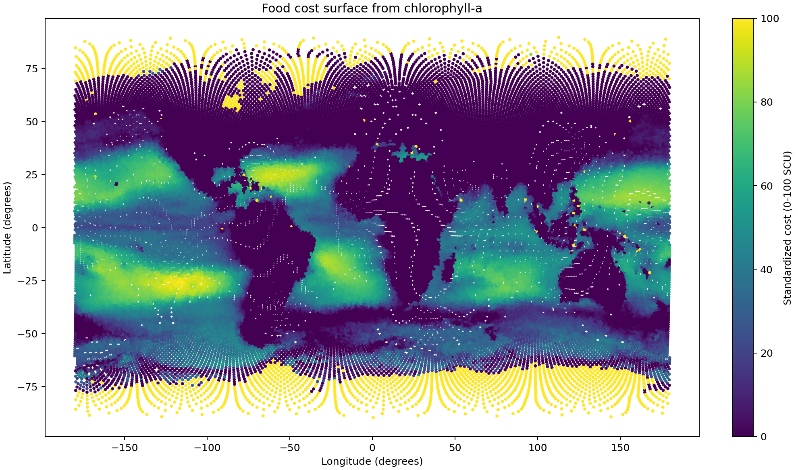

# Compute H3 cost components

## Question
What do the raw and standardized movement-cost components look like on the directed H3 graph, and do they correctly preserve the published food-cost logic?

## Input data
- `data/processed/grids/h3_edge_environment_res3.csv`
- `data/processed/grids/h3_environment_res3.csv`

## Audit result: food-cost correction
The first implementation needed one important correction.

The paper logic implies:
- low chlorophyll should produce high food cost
- high chlorophyll should produce low food cost
- cells above the productivity threshold should collapse toward the same low-cost class

The original implementation preserved that direction for positive chlorophyll values, but treated zero chlorophyll as missing after the log transform. That was not acceptable, because zero-food cells should behave like very poor food cells, not drop out.

The corrected implementation now:
- replaces non-positive chlorophyll with a small positive floor before taking the log
- uses the smallest positive chlorophyll value in the H3 environmental table as that floor
- therefore keeps zero-chlorophyll cells in the cost surface as high-cost cells

Audit values:
- zero or non-positive chlorophyll cells in H3 table: **1869**
- positive chlorophyll floor used for the log transform: **0.02446900**
- cells outside the common wind-supported map footprint: **11633**
- shared map color scale maximum (P99 cap across displayed map layers): **100.000 SCU**

## Method
- compute directional edge costs for parallel wind, crosswind, extra edge distance relative to a typical neighbor step, and food
- standardize each component with the agreed P99-based scaling philosophy
- additionally produce four cell-level component maps for transparency
- for the two wind component maps, assume a bird flying in a straight northward direction everywhere
- for the distance map, assign to each cell the true distance of the outgoing edge whose bearing is closest to north
- for visualization only, use the wind-data footprint as a common support mask across all four maps so unsupported cells are not mistaken for valid low or high costs
- apply one shared color scale across all four maps, starting at 0 and ending at the shared P99 of the displayed standardized map values
- summarize edge distance by bearing sector and latitude band to check whether visible distance-map patterns reflect real directional anisotropy in the graph

## Key formulas used
- movement direction comes from the edge bearing for the edge-level table
- wind support is the projection of the source wind vector onto the movement direction
- raw parallel wind cost = distance from `P99(windsupport)`
- raw crosswind cost = magnitude of the wind component perpendicular to movement
- raw distance cost = extra H3 edge distance beyond the median H3 neighbor-step distance, floored at zero
- diagnostic distance map = extra distance of the outgoing edge whose bearing is closest to north, relative to the same median step length
- raw food cost = `|log(chla) + 1|` after capping high-productivity cells and flooring non-positive chlorophyll values for numerical stability
- standardized component cost = `100 * raw_component / P99(raw_component)`

## Outputs
- component table: `data/processed/grids/h3_edge_cost_components_res3.csv`
- summary table: `results/tables/11_compute_h3_cost_components_summary.csv`
- example rows: `results/tables/11_compute_h3_cost_components_example_rows.csv`
- figures:
  - `results/figures/11_raw_component_histograms.png`
  - `results/figures/11_standardized_component_histograms.png`
  - `results/figures/11_wind_vs_crosswind_scatter.png`
  - `results/figures/11_directional_edge_distance_by_bearing.png`
  - `results/figures/11_map_parallel_wind_cost_northward.png`
  - `results/figures/11_map_crosswind_cost_northward.png`
  - `results/figures/11_map_distance_cost.png`
  - `results/figures/11_map_food_cost.png`

## Quick-look figures

## Interpretation
This step now does what it should scientifically: it creates an explicit directional cost graph while keeping the food surface behavior consistent with the published logic that poor-food cells must be expensive.

The main methodological refinement in this version is the distance term. The first H3 implementation used raw edge length scaled directly to the P99, which made most H3 edges cluster close to the upper standardized range because neighbor distances at one H3 resolution are fairly similar. The revised formulation is more defensible: it treats a typical median H3 neighbor step as the zero-baseline distance cost and penalizes only the extra distance beyond that baseline.

The four maps are also useful because they separate two different views of the model:
- edge-level directional costs used in the real path calculations
- cell-level component surfaces used for intuitive inspection

For the wind maps, the northward-flight assumption is only for visualizing the directional wind components as a global surface. The real graph still uses each actual edge bearing.
For the distance map, each cell is assigned the true distance of its outgoing edge closest to north. This is also diagnostic rather than part of the routing graph itself, but it is a real edge quantity rather than an artificial cumulative construction.

The pole issue in the earlier food map was not something I was happy with. It mixed genuinely poor-food cells with cells that simply lie outside the shared environmental support. Using the wind footprint as a visualization mask is the right fix for the maps, because it prevents unsupported cells from being visually interpreted as real food-cost values.

The directional distance diagnostic helps interpret the odd blue corridor patterns in the northward distance map. Those patterns are partly a consequence of selecting a single outgoing edge per cell for display, but the bearing-by-latitude summary lets us check whether there is also real directional variation in edge distances in the H3 graph.

## Points to watch
- the distance component in the routing model now represents extra H3 edge length relative to a typical median neighbor step, which is an intentional refinement relative to the legacy constant-per-step distance term
- the mapped northward distance surface is a separate diagnostic layer for interpretability, based on the extra length of a real outgoing northward edge per cell relative to the same baseline
- the common wind-footprint mask is a visualization choice for consistency and honesty across maps, not yet a modeling exclusion rule
- the shared P99-capped color scale makes map-to-map magnitude comparisons easier while preserving more contrast than a raw-maximum scale
- if the directional distance summary shows strong systematic bearing effects, we should keep that in mind when interpreting later Dijkstra behavior
- the median H3 neighbor-step baseline used for the revised distance term is **121.874 km**
- the legacy constant distance reference extracted from the standardized wind term is **49.999**, which provides a direct bridge back to the earlier formulation
- the visual wind maps are diagnostic surfaces, not replacements for the directional edge-level calculations

## Next step
Combine these standardized components using selected weight sets and run the first Dijkstra path calculation for the H3 graph.
