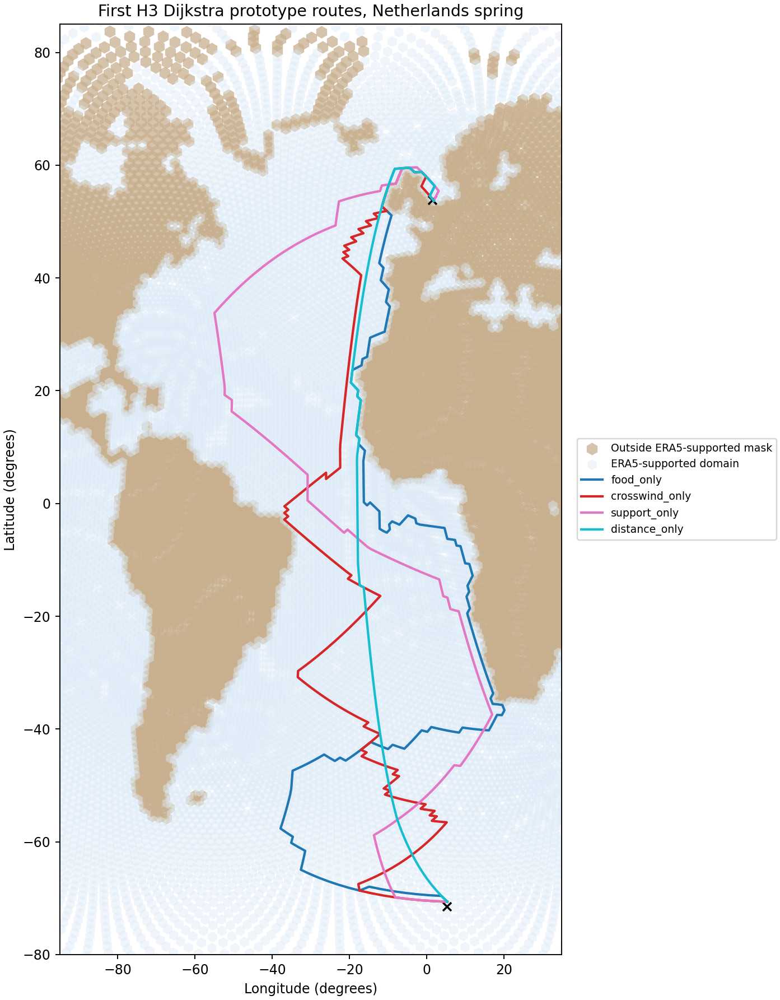
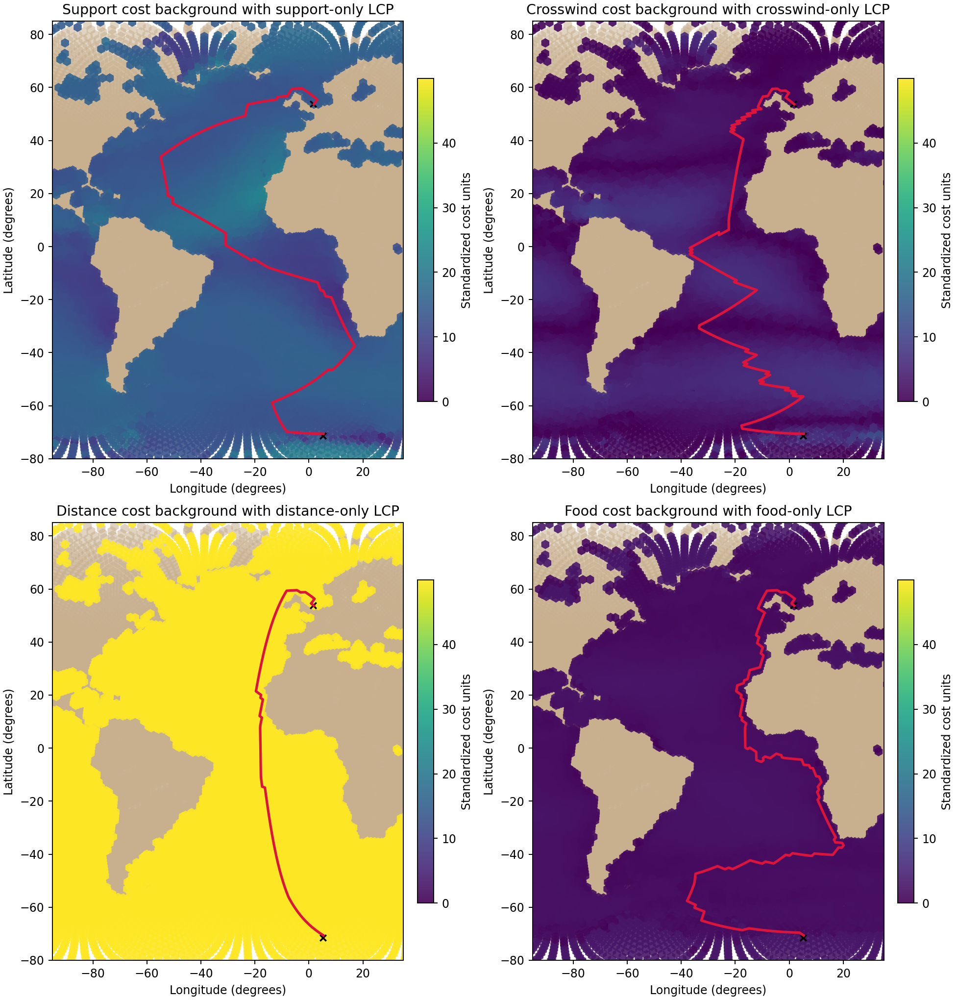

# Run first H3 Dijkstra prototype, Netherlands spring

## Question
What do the four extreme single-factor prototype behaviors produce for the Netherlands spring case on the H3 cost graph?

## Endpoint rule used
- start point = first row of `gdf_NS_10.csv`
- end point = last row of `gdf_NS_10.csv`
- both matched to nearest H3 cells

## Outputs
- path table: `data/processed/routes/h3_dijkstra_netherlands_spring_paths.csv`
- route summary table: `results/tables/12_netherlands_dijkstra_summary.csv`
- weight table: `results/tables/12_netherlands_dijkstra_weight_sets.csv`
- endpoint table: `results/tables/12_netherlands_dijkstra_endpoints.csv`
- route overview figure: `results/figures/12_netherlands_dijkstra_routes.png`
- component-overlay figure: `results/figures/12_netherlands_component_maps_with_lcps.png`

## Quick-look figures

## Run summary
- number of tested behaviors: **4**
- number of successful route runs: **4**

## Efficiency note
This reporting step reuses saved step-12 route outputs and does not rerun Dijkstra.
