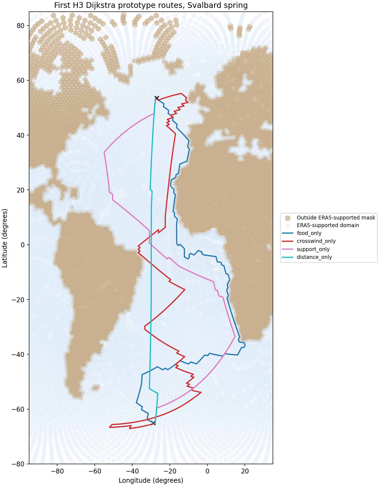
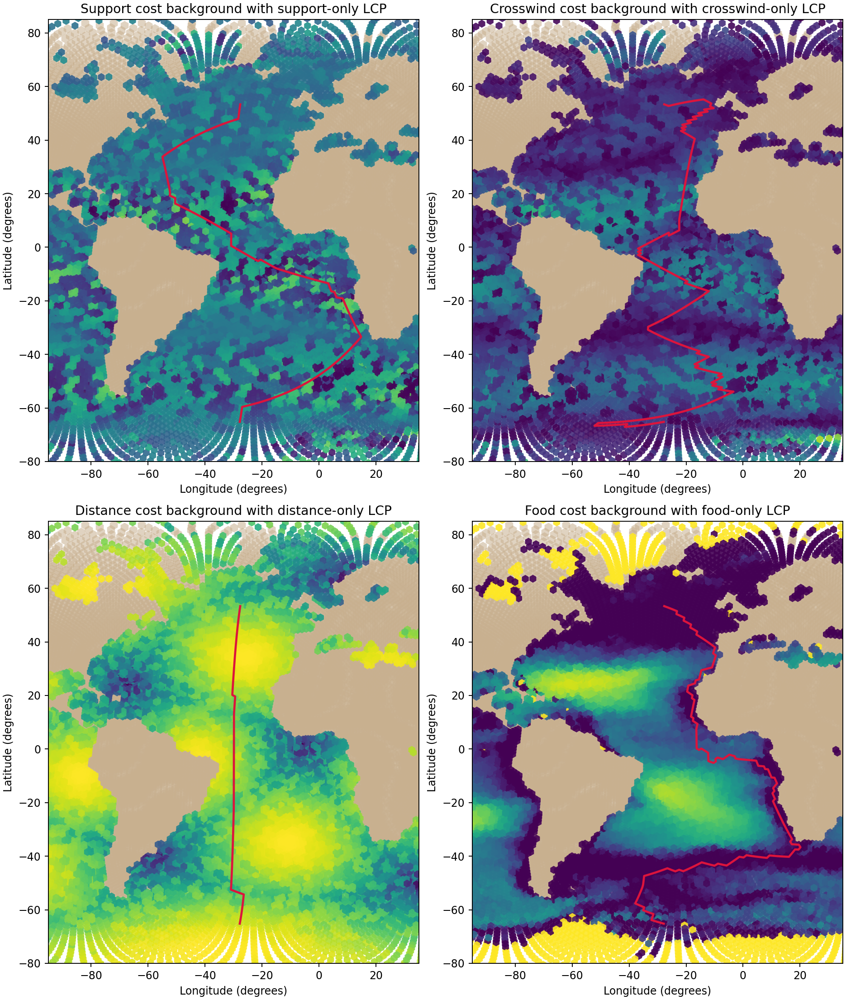

# Run first H3 Dijkstra prototype

## Question
What happens when the first Svalbard spring H3 Dijkstra tests are run under four extreme single-factor behaviors, using the current prototype endpoint rule and the ERA5-supported routing mask?

## Input data
- `data/processed/grids/h3_edge_cost_components_res3.csv`
- `data/processed/grids/h3_environment_res3.csv`
- `data/raw/benchmark_from_2025/gdf_SS_10.csv`

## Tested single-factor behaviors
This first extreme-behavior batch uses only four single-factor cases, with coefficient order:
- `a = wind support`
- `b = crosswind`
- `c = distance`
- `d = food`

The tested behaviors are:
- `support_only = (1.0, 0.0, 0.0, 0.0)`
- `crosswind_only = (0.0, 1.0, 0.0, 0.0)`
- `distance_only = (0.0, 0.0, 1.0, 0.0)`
- `food_only = (0.0, 0.0, 0.0, 1.0)`

See:
- `results/tables/12_svalbard_dijkstra_weight_sets.csv`

## Routing mask used
Following the paper's overwater-routing stance, the first H3 prototype now uses the transferred benchmark ERA5 support as its routing-domain mask.

Implementation here:
- identify H3 cells that have valid transferred `u10` and `v10` values in the benchmark environmental table
- keep only edges whose source and target both lie inside that supported domain
- show the supported versus masked cells directly on the route figure using different colors and gridcell-like hex markers rather than centroid dots

Interpretation:
- this is a routing-domain mask based on the environmental support actually used in the cost construction
- it should be interpreted as a benchmark ERA5-supported domain for the prototype, not yet as a final polished biological mask definition

## Prototype endpoint rule used
This first Dijkstra test still uses a pragmatic temporary endpoint rule rather than a final biological endpoint definition.

Implementation here:
- start point = mean of the first **3** benchmark summary points
- end point = mean of the last **3** benchmark summary points
- these mean points were then matched to the nearest H3 cells

See:
- `results/tables/12_svalbard_dijkstra_endpoints.csv`

## Outputs
- path table: `data/processed/routes/h3_dijkstra_svalbard_spring_paths.csv`
- route summary table: `results/tables/12_svalbard_dijkstra_summary.csv`
- failed-behavior table when relevant: `results/tables/12_svalbard_dijkstra_failures.csv`
- weight table: `results/tables/12_svalbard_dijkstra_weight_sets.csv`
- endpoint table: `results/tables/12_svalbard_dijkstra_endpoints.csv`
- route figure: `results/figures/12_svalbard_dijkstra_routes.png`
- diagnostic overlay figure: `results/figures/12_component_maps_with_lcps.png`

Map framing:
- the route figure is focused on the Atlantic domain
- the figure now uses a more portrait-oriented layout to make the trans-Atlantic route geometry easier to inspect
- the routing mask is visualized with gridcell-like hex markers rather than sparse centroid dots, so the supported and masked regions read more like spatial cells

## Quick-look figure

## Why the overlay figure is useful, and its limit
The overlay figure is scientifically useful as a **diagnostic comparison**.
It helps us check whether each single-factor route is moving through visually low-cost regions of the corresponding component background.

However, it should not be interpreted too literally as the exact optimization surface used by Dijkstra, because:
- the real routing is done on the directed edge graph
- the background panels are cell-level diagnostic surfaces
- the wind backgrounds are simplified visualization surfaces rather than the full edge-based object

So this figure is appropriate for interpretation, but it remains a diagnostic comparison rather than a perfect one-to-one representation of the graph optimization problem.

## Run status summary
- number of tested behaviors: **4**
- number of successful route runs: **4**
- number of failed route runs: **0**

## Interpretation
This is the first end-to-end H3 route prototype with an explicit ERA5-supported routing domain. That is an important milestone, because the project has now moved from component construction into actual destination-constrained path generation.

At the same time, the current outputs should still be treated as diagnostic prototype results rather than validated flyway simulations. That caution is needed because:
- the endpoint rule is still provisional
- the distance term remains under explicit caution
- the current batch uses deliberately extreme single-factor behaviors
- some behaviors do not yet yield stable successful Dijkstra results under the present setup

This means the present run is most useful for exposing model behavior and failure modes, not for making strong biological claims.

## What to pay attention to
- whether the successful routes look strongly grid-aligned
- whether the single-factor runs differ in interpretable ways or collapse toward similar paths
- whether failures cluster in particular components, which would suggest component-specific pathologies rather than a generic routing issue
- whether the provisional endpoint rule is suppressing or exaggerating differences among behaviors

## Next step
Inspect the successful and failed single-factor runs explicitly, then decide whether to refine the endpoint definition, modify the tested behavior set, or adjust the cost setup before moving further into comparison against the benchmark flyway.

Additional route summary:
- best current prototype by total cost: **food_only**
- best prototype total cost: **1292.521**
- best prototype total distance: **22714.0 km**
- best prototype step count: **190**
