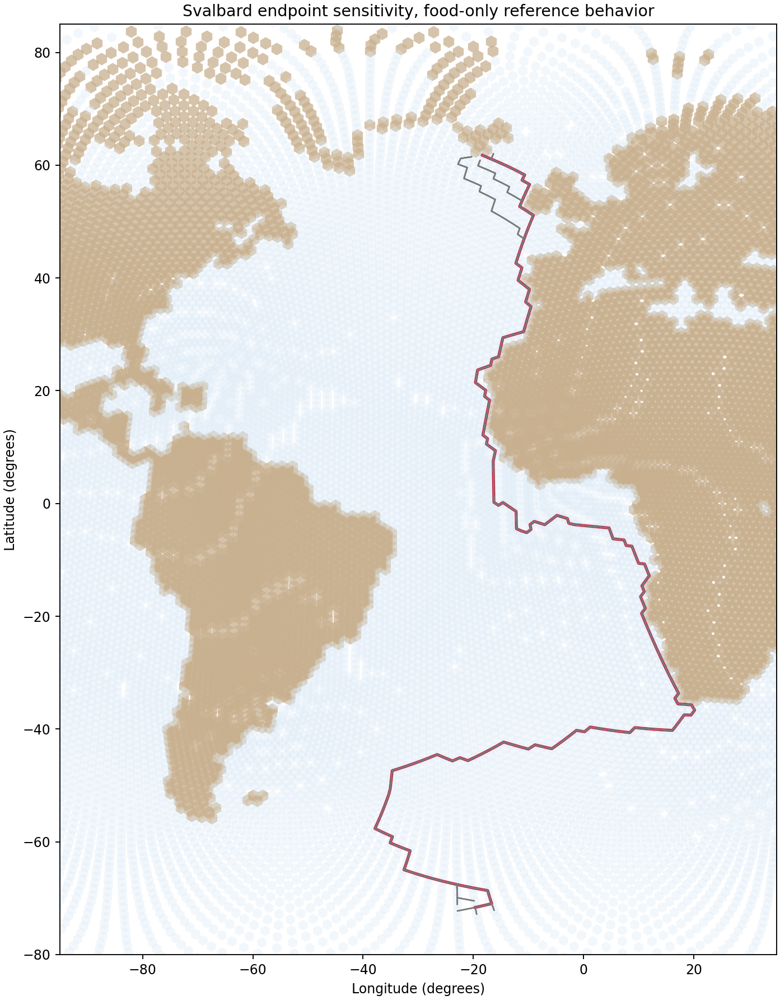

# Endpoint sensitivity for Svalbard spring

## Question
How sensitive are the four current extreme-behavior routes to small changes in start and end H3 cells around the reference validation endpoints?

## Setup
- reference start cell: `83eea8fffffffff`
- reference end cell: `83076bfffffffff`
- tested behaviors: `support_only`, `crosswind_only`, `distance_only`, `food_only`
- tested start cells: reference cell plus randomly sampled cells from its H3 k=2 neighborhood
- tested end cells: reference cell plus randomly sampled cells from its H3 k=2 neighborhood
- random seed: `42`
- output route table kept intentionally compact, with coordinates only

## Outputs
- route coordinates: `results/tables/13_svalbard_endpoint_sensitivity_coordinates.csv`
- tested endpoint pairs: `results/tables/13_svalbard_endpoint_sensitivity_endpoints.csv`
- overlay figure: `results/figures/13_svalbard_endpoint_sensitivity_routes.png`

## Quick-look figure

## Map styling
- reference least-cost path shown in **red**
- alternative endpoint-sensitivity routes shown in **grey**
- backgrounds use the usual four component cost maps for direct comparison

## Run summary
- successful routes across all tested behavior-endpoint combinations: **324**

## Interpretation
This figure is useful because it asks a focused structural question before we broaden the behavior space: do small changes in endpoint placement materially alter the least-cost routes, or do the routes remain broadly organized by the cost field itself?

The encouraging part is that the sensitivity experiment can now be inspected behavior by behavior on the same four background maps already used in the main prototype report. That makes it much easier to judge whether endpoint perturbations produce only local spreading near the termini or whether they reorganize the trans-Atlantic route geometry more fundamentally.

The key thing to look for here is not whether every grey line sits exactly on the red line. Some divergence is expected. The important question is whether each behavior preserves a recognizable corridor structure under moderate endpoint perturbation, or whether the route geometry fragments substantially when the start and end cells are nudged within a wider local neighborhood.

If the grey bundles remain fairly coherent around the red reference path for a behavior, that behavior looks more robust to endpoint choice. If the bundle fans out widely or switches corridor entirely, that behavior is more endpoint-sensitive and should be interpreted more cautiously in later comparisons.

So this step should be read as a diagnostic robustness check, not as a validation result by itself. Its job is to tell us whether the current prototype routes are structurally stable enough to justify the next stage of comparison and expansion.
