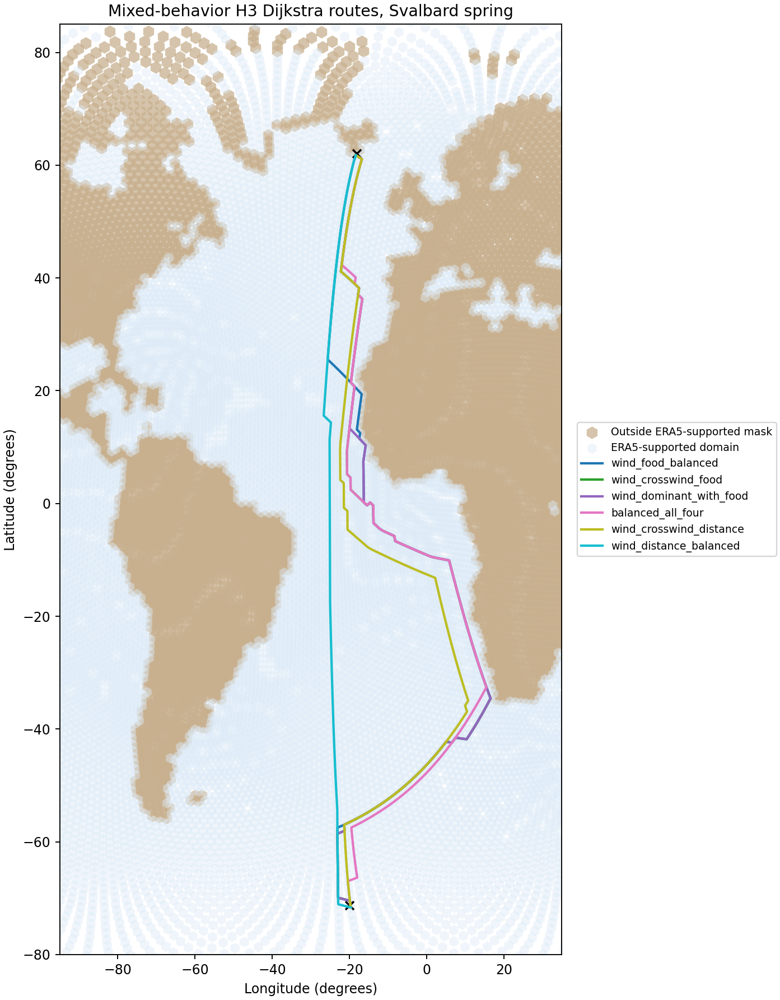
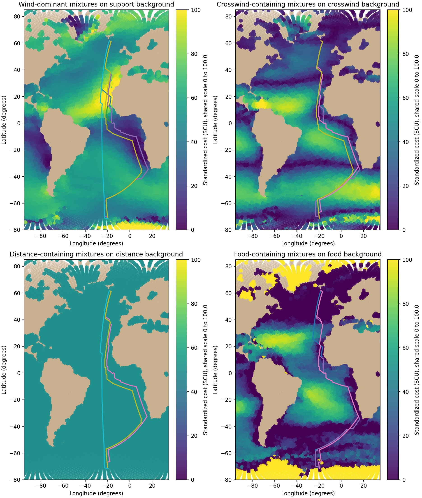

# Run mixed-behavior H3 Dijkstra batch

## Outputs
- path table: `results/tables/14_svalbard_mixed_dijkstra_paths.csv`
- route summary table: `results/tables/14_svalbard_mixed_dijkstra_summary.csv`
- weight table: `results/tables/14_svalbard_mixed_dijkstra_weight_sets.csv`
- endpoint table: `results/tables/14_svalbard_mixed_dijkstra_endpoints.csv`
- route figure: `results/figures/14_svalbard_mixed_dijkstra_routes.png`
- diagnostic overlay figure: `results/figures/14_mixed_component_maps_with_lcps.png`

## Quick-look figures

## Run summary
- number of tested mixed behaviors: **6**
- number of successful route runs: **6**
- number of failed route runs: **0**

## Efficiency note
This reporting step reuses saved step-14 mixed-route outputs and does not rerun Dijkstra.

Additional route summary:
- lowest total modeled path cost in this mixed batch: **wind_food_balanced**
- corresponding total cost: **3808.970**
- corresponding total distance: **19137.5 km**
