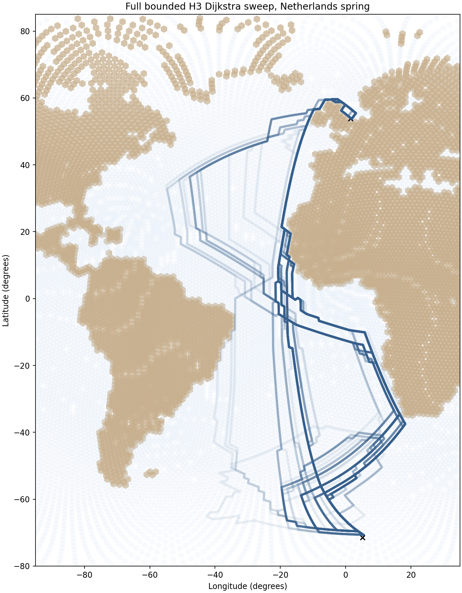
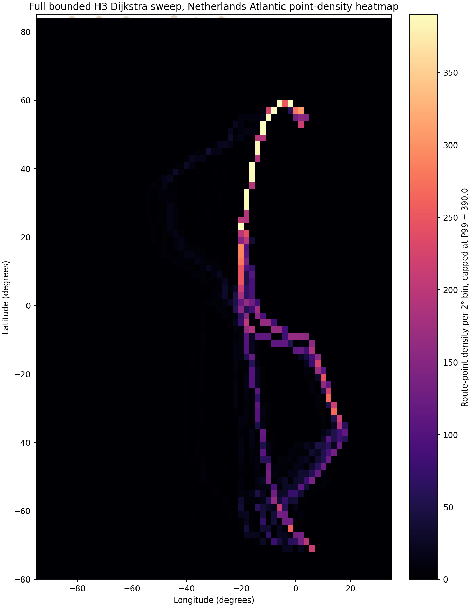

# Run full bounded H3 Dijkstra sweep, Netherlands spring

## Question
What does the current full bounded H3 behavior grid produce for the Netherlands spring case?

## Outputs
- path table: `results/tables/15_netherlands_full_bounded_dijkstra_paths.csv`
- route summary table: `results/tables/15_netherlands_full_bounded_dijkstra_summary.csv`
- weight table: `results/tables/15_netherlands_full_bounded_dijkstra_weight_sets.csv`
- endpoint table: `results/tables/15_netherlands_full_bounded_dijkstra_endpoints.csv`
- route overview figure: `results/figures/15_netherlands_full_bounded_dijkstra_routes.png`
- route-point density heatmap: `results/figures/15_netherlands_full_bounded_dijkstra_point_density_heatmap.png`

## Quick-look figures

## Run summary
- number of tested behaviors: **216**
- number of successful route runs: **216**

## Efficiency note
This reporting step reuses saved step-15 route outputs and does not rerun the full bounded sweep.
