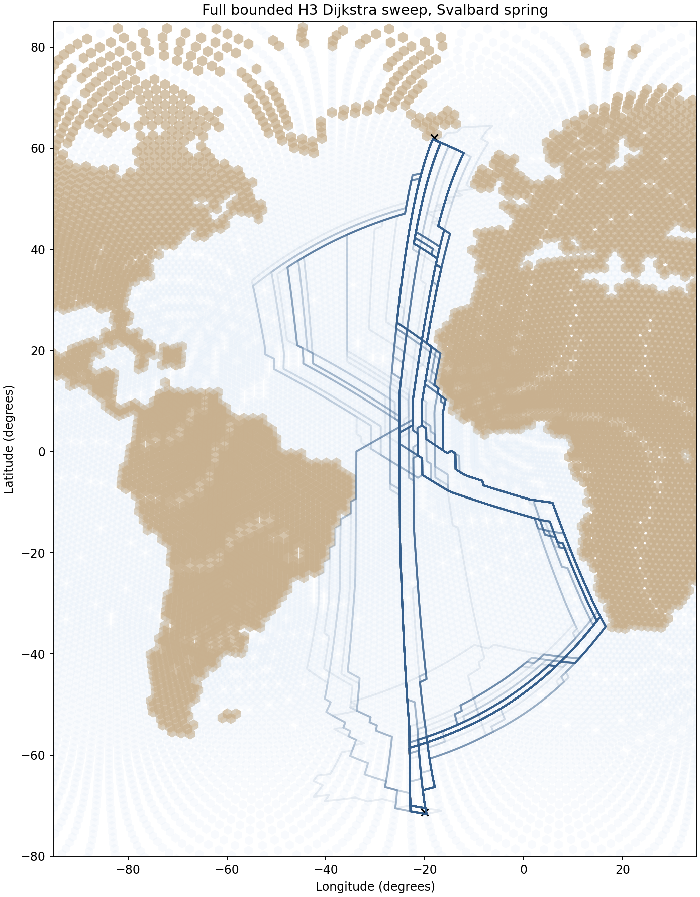
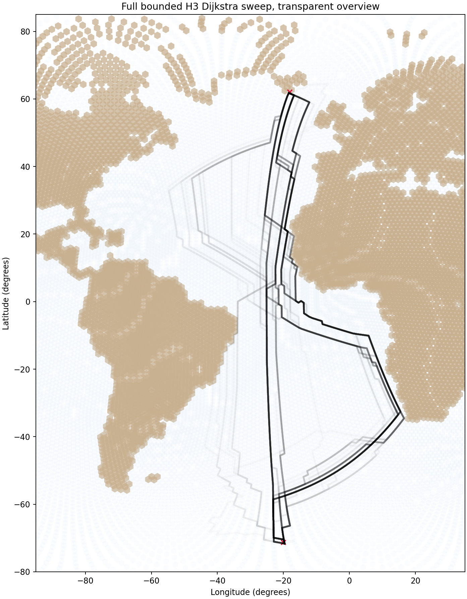
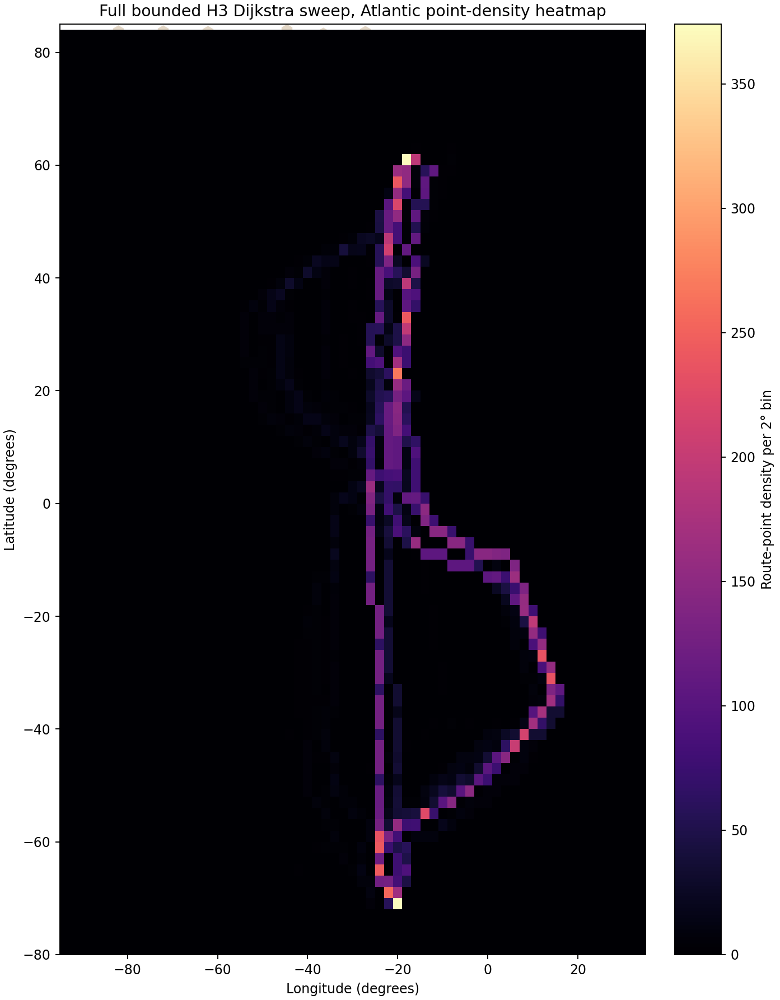

# Run full bounded H3 Dijkstra sweep

## Question
What do all coefficient combinations from the currently documented bounded H3 behavior grid produce for the Svalbard spring case?

## Important scope note
This sweep uses the currently documented bounded grid:
- `a` wind from 0.0 to 1.0 by 0.1
- `b` crosswind from 0.0 to 0.5 by 0.1
- `c` distance from 0.0 to 1.0 by 0.1
- `d` food from 0.0 to 0.5 by 0.1
- `a + b + c + d = 1.0`

Under those rules, the sweep contains **216** behaviors.
This is explicitly the full bounded grid under the current project rules, not a claim that it exactly reproduces the paper's 195-filtered behavior set.

## Endpoint rule used
- start point = first row of `gdf_SS_10.csv`
- end point = last row of `gdf_SS_10.csv`
- both matched to nearest H3 cells

See:
- `results/tables/15_svalbard_full_bounded_dijkstra_endpoints.csv`

## Outputs
- path table: `results/tables/15_svalbard_full_bounded_dijkstra_paths.csv`
- route summary table: `results/tables/15_svalbard_full_bounded_dijkstra_summary.csv`
- weight table: `results/tables/15_svalbard_full_bounded_dijkstra_weight_sets.csv`
- endpoint table: `results/tables/15_svalbard_full_bounded_dijkstra_endpoints.csv`
- failed-behavior table when relevant: `results/tables/15_svalbard_full_bounded_dijkstra_failures.csv`
- route overview figure: `results/figures/15_svalbard_full_bounded_dijkstra_routes.png`
- transparent route overview figure: `results/figures/15_svalbard_full_bounded_dijkstra_routes_transparent.png`
- route-point density heatmap: `results/figures/15_svalbard_full_bounded_dijkstra_point_density_heatmap.png`

## Quick-look figures

## Run summary
- number of tested behaviors: **216**
- number of successful route runs: **216**
- number of failed route runs: **0**

## Interpretation
This step creates the full candidate pool under the currently documented bounded coefficient rules. That matters because the main goal is not to identify the route with the lowest internal modeled path cost, but to generate the full set of candidate least-cost paths that can later be compared against the Svalbard spring benchmark flyway.

So the main value of this sweep is coverage. It ensures that later route-to-benchmark comparison is done against the whole bounded grid rather than a hand-picked subset. The overview plots are therefore not final results by themselves. They are a structural map of the available simulated route family under the current cost graph.

The key things to inspect visually are:
- whether the route family collapses into a few dominant corridors or fills a broad envelope
- whether some combinations appear to produce visibly implausible detours or extreme spread
- whether the route cloud suggests that the current graph and endpoint setup are capable of spanning the benchmark flyway geometry at all
- whether the semi-transparent wide-line plots and the point-density heatmap reveal concentrated corridor use or a much more diffuse route field across the Atlantic domain

## Next step
Use this full bounded route set as the candidate pool for the first explicit route-to-benchmark comparison against the Svalbard spring 10-degree mean flyway.
