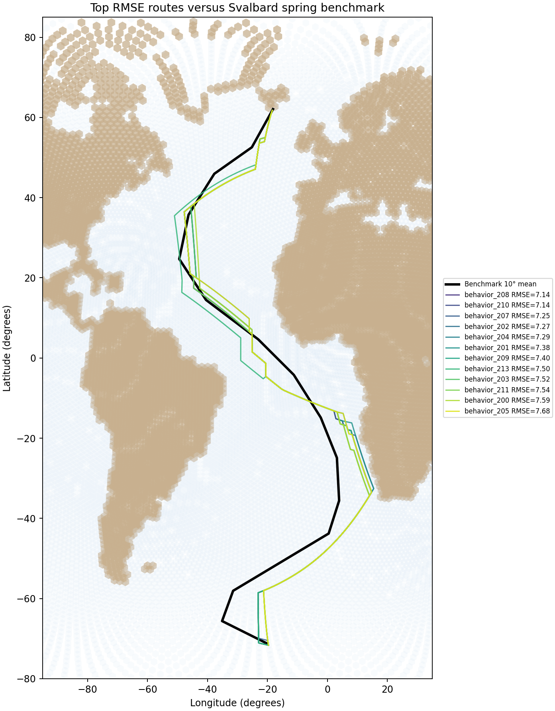
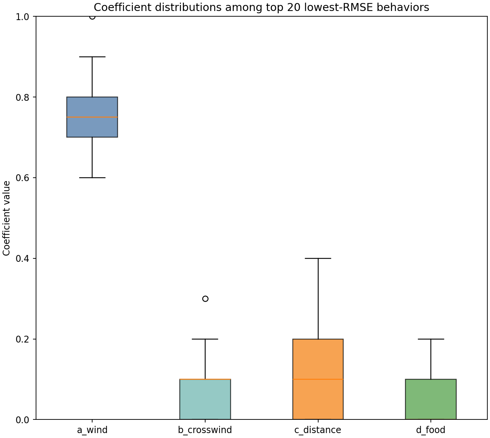

# Evaluate full bounded Svalbard sweep by RMSE

## Question
Which behaviors from the saved 216-route full bounded Svalbard sweep best recreate the benchmark spring flyway summary in `gdf_SS_10.csv`?

## Evaluation rule
For each simulated route:
- reconstruct the route as an ordered polyline from saved route coordinates
- summarize the route by 10° latitude bands
- compute the median longitude of the simulated route within each band
- compare that to the benchmark median longitude in the same band
- compute RMSE across all bands where both benchmark and simulated values are available

This matches the benchmark-comparison logic much more closely than ranking by internal path cost.

## Inputs
- saved routes: `results/tables/15_svalbard_full_bounded_dijkstra_paths.csv`
- saved behavior table: `results/tables/15_svalbard_full_bounded_dijkstra_weight_sets.csv`
- benchmark summary: `data/raw/benchmark_from_2025/gdf_SS_10.csv`

## Outputs
- RMSE table: `results/tables/16_svalbard_full_bounded_rmse.csv`
- per-band route summaries: `results/tables/16_svalbard_full_bounded_route_band_summaries.csv`
- top-route map: `results/figures/16_svalbard_top_rmse_routes.png`
- coefficient boxplots for top 20 RMSE behaviors: `results/figures/16_svalbard_top_rmse_coefficient_boxplots.png`

## Quick-look figures

## Main result
- lowest-RMSE behavior: **behavior_208**
- lowest RMSE: **7.140 longitude degrees**
- compared latitude bands: **15**
- weights: **(0.8, 0.0, 0.1, 0.1)**

## Interpretation
This is the first ranking step that directly addresses the real scientific goal of the Svalbard spring prototype: which simulated least-cost paths best recreate the observed 10-degree mean flyway.

That makes this step much more meaningful than any earlier ranking by internal path cost. The RMSE table now provides the correct candidate ordering for further inspection.

The most important things to inspect next are:
- whether the lowest-RMSE behaviors cluster in a recognizable region of coefficient space
- whether the coefficient boxplots show clear concentration or broad spread for wind, crosswind, distance, and food among the top 20 behaviors
- whether the top routes converge on a coherent flyway shape or remain quite different despite similar RMSE values
- whether the top-ranked routes also look biologically reasonable when plotted, rather than only numerically favorable under the benchmark summary metric

## Efficiency note
This evaluation script reuses the saved full-sweep route outputs and does not rerun the Dijkstra simulations.

## Next step
Inspect the top RMSE behaviors in detail and decide whether to refine the coefficient space, compare against the paper's filtered behavior set, or move to the Netherlands spring case.
