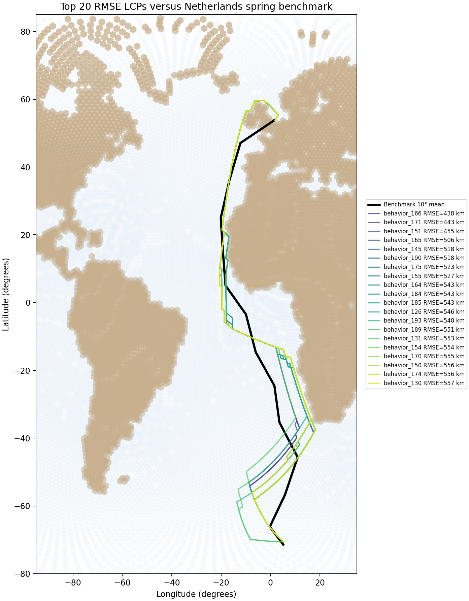
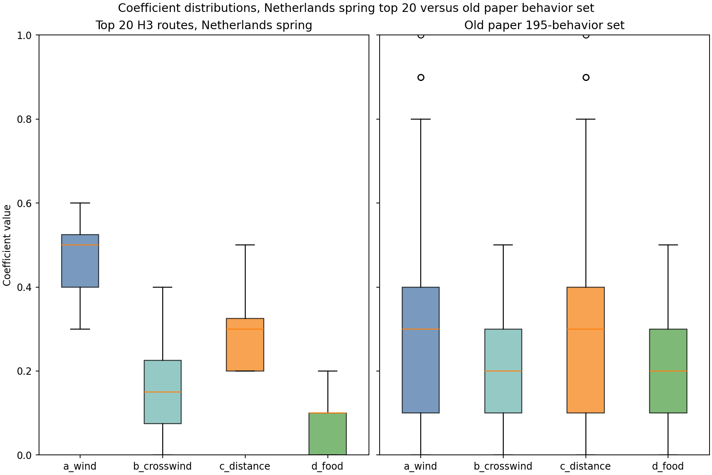

# Evaluate full bounded Netherlands spring sweep by RMSE

## Question
Which behaviors from the saved 216-route full bounded Netherlands spring sweep best recreate the benchmark flyway summary?

## Evaluation rule
For each simulated route:
- reconstruct the route as an ordered polyline from saved route coordinates
- summarize the route by 10° latitude bands
- compute the median longitude of the simulated route within each band
- compare that to the benchmark median longitude in the same band
- compute RMSE in km across all bands where both benchmark and simulated values are available

## Outputs
- RMSE table: `results/tables/16_netherlands_full_bounded_rmse.csv`
- per-band route summaries: `results/tables/16_netherlands_full_bounded_route_band_summaries.csv`
- top-20 route map: `results/figures/16_netherlands_full_bounded_top20_rmse_routes.png`
- coefficient boxplots: `results/figures/16_netherlands_full_bounded_top_rmse_coefficient_boxplots.png`

## Quick-look figures

## Main result
- lowest-RMSE behavior: **behavior_166**
- lowest RMSE: **437.9 km**
- compared latitude bands: **14**
- weights: **(0.5, 0.0, 0.5, 0.0)**

## Efficiency note
This evaluation reuses saved route outputs and does not rerun Dijkstra simulations.
