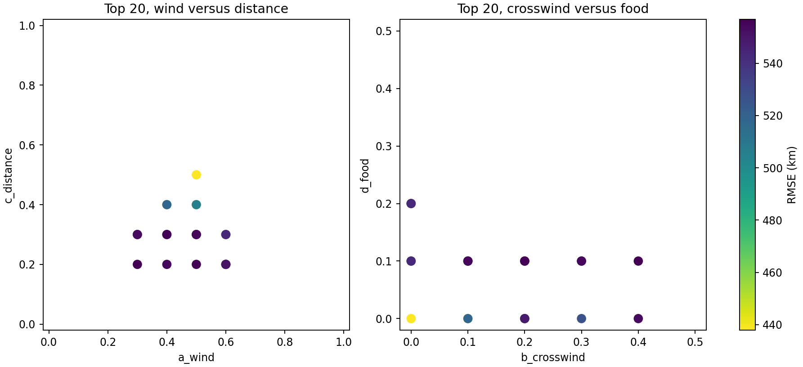
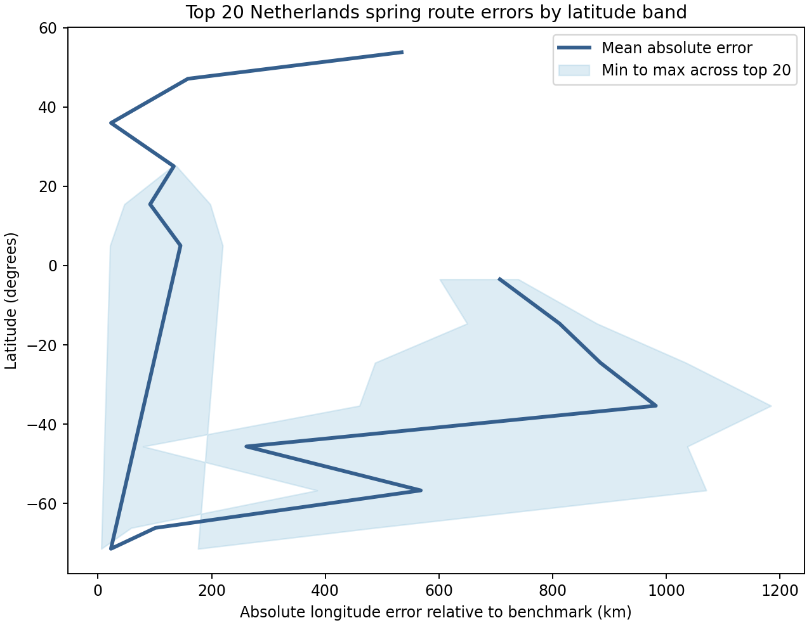
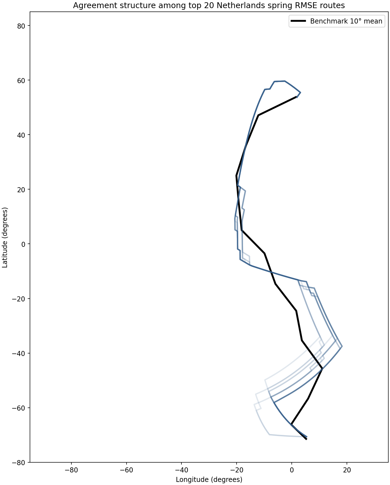

# Interpret top RMSE Netherlands spring behaviors

## Question
What structure appears among the 20 lowest-RMSE H3 Netherlands spring routes, and where do they still diverge most strongly from the benchmark flyway?

## Outputs
- top-20 RMSE table: `results/tables/17_netherlands_top20_rmse_behaviors.csv`
- top-20 band-error summary: `results/tables/17_netherlands_top20_band_error_summary.csv`
- coefficient scatter figure: `results/figures/17_netherlands_top20_coefficient_scatter.png`
- latitude-band error figure: `results/figures/17_netherlands_top20_band_errors.png`
- route-agreement figure: `results/figures/17_netherlands_top20_route_agreement.png`

## Quick-look figures

## Top-ranked behavior
- behavior: **behavior_166**
- RMSE: **437.9 km**
- weights: **(0.5, 0.0, 0.5, 0.0)**

## Coefficient structure among top 20
- a_wind: min 0.3, median 0.5, max 0.6
- b_crosswind: min 0.0, median 0.2, max 0.4
- c_distance: min 0.2, median 0.3, max 0.5
- d_food: min 0.0, median 0.1, max 0.2

## Latitude-band error structure
- lowest mean top-20 error band: **(-80, -70]**, mean absolute error **22.8 km**
- highest mean top-20 error band: **(-40, -30]**, mean absolute error **981.7 km**

## Efficiency note
This interpretation reuses the saved RMSE, band-summary, and route outputs only.
