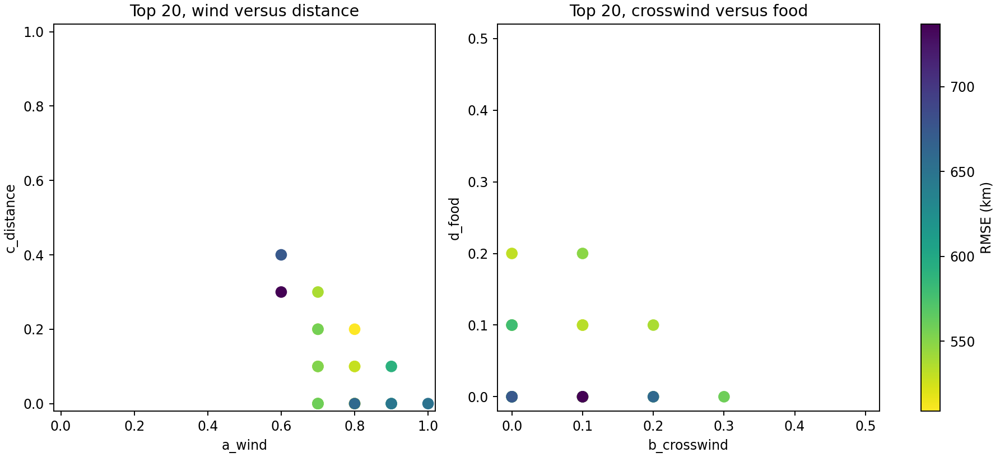
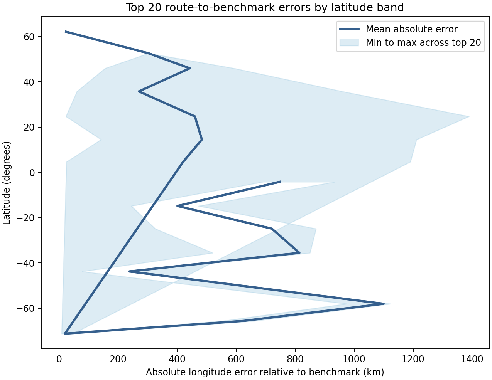
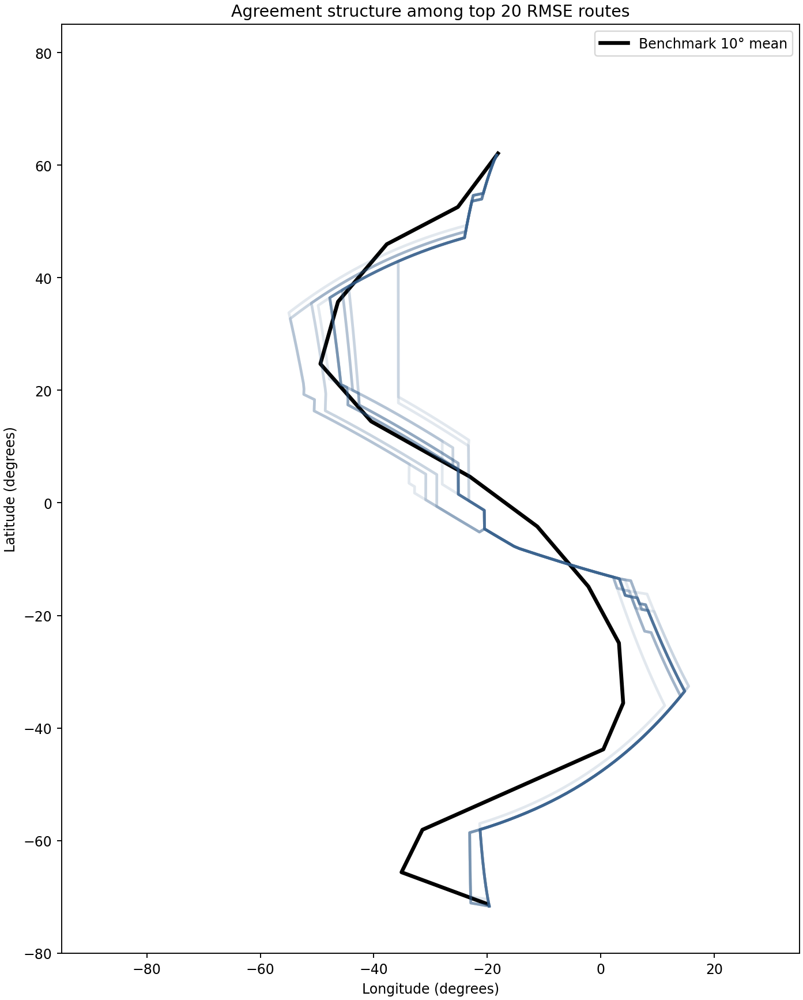

# Interpret top RMSE Svalbard behaviors

## Question
What structure appears among the 20 lowest-RMSE H3 Svalbard spring routes, and where do they still diverge most strongly from the benchmark flyway?

## Inputs
- RMSE ranking: `results/tables/16_svalbard_full_bounded_rmse.csv`
- per-band error table: `results/tables/16_svalbard_full_bounded_route_band_summaries.csv`
- saved routes: `results/tables/15_svalbard_full_bounded_dijkstra_paths.csv`

## Outputs
- top-20 RMSE table: `results/tables/17_svalbard_top20_rmse_behaviors.csv`
- top-20 band-error summary: `results/tables/17_svalbard_top20_band_error_summary.csv`
- coefficient scatter figure: `results/figures/17_svalbard_top20_coefficient_scatter.png`
- latitude-band error figure: `results/figures/17_svalbard_top20_band_errors.png`
- route-agreement figure: `results/figures/17_svalbard_top20_route_agreement.png`

## Quick-look figures

## Top-ranked behavior
- behavior: **behavior_209**
- RMSE: **508.9 km**
- weights: **(0.8, 0.0, 0.2, 0.0)**

## Coefficient structure among top 20
- a_wind: min 0.6, median 0.8, max 1.0
- b_crosswind: min 0.0, median 0.1, max 0.3
- c_distance: min 0.0, median 0.1, max 0.4
- d_food: min 0.0, median 0.0, max 0.2

## Latitude-band error structure
- lowest mean top-20 error band: **(-80, -70]**, mean absolute error **19.5 km**
- highest mean top-20 error band: **(-60, -50]**, mean absolute error **1099.9 km**

## Interpretation
The top 20 RMSE behaviors are not spread uniformly across coefficient space. They cluster strongly toward high wind weight, with only modest contributions from crosswind, distance, and food. That means benchmark agreement is currently being driven mainly by wind-favored routing, not by strongly food-dominated or crosswind-dominated behavior.

The route-agreement figure should be read as a structural summary of the top candidate family. If the top 20 routes remain tightly bundled, that suggests the current benchmark favors a fairly specific H3 corridor. If they fan out but still achieve similar RMSE, that means the latitude-binned benchmark metric is tolerating multiple geometrically different route shapes.

The latitude-band error summary shows where the current H3 route family still struggles most against the benchmark flyway. Those high-error bands are the most important places to inspect next, because they may point to endpoint effects, grid effects, or limitations in the current cost structure.

## Next step
Use the top-20 interpretation to decide whether to tighten the Svalbard coefficient search around the wind-dominant region, inspect the highest-error latitude bands more closely, or move on to the Netherlands spring case with the same evaluation pipeline.
