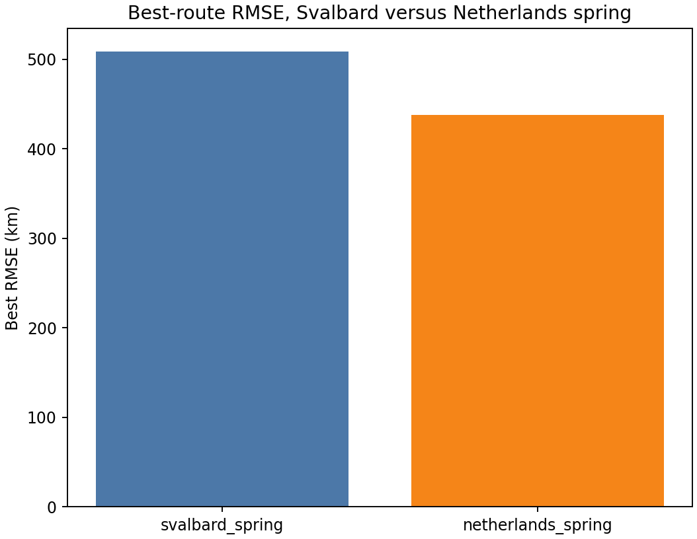
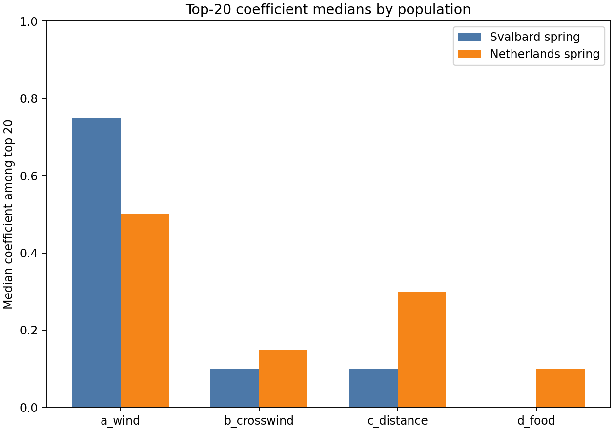
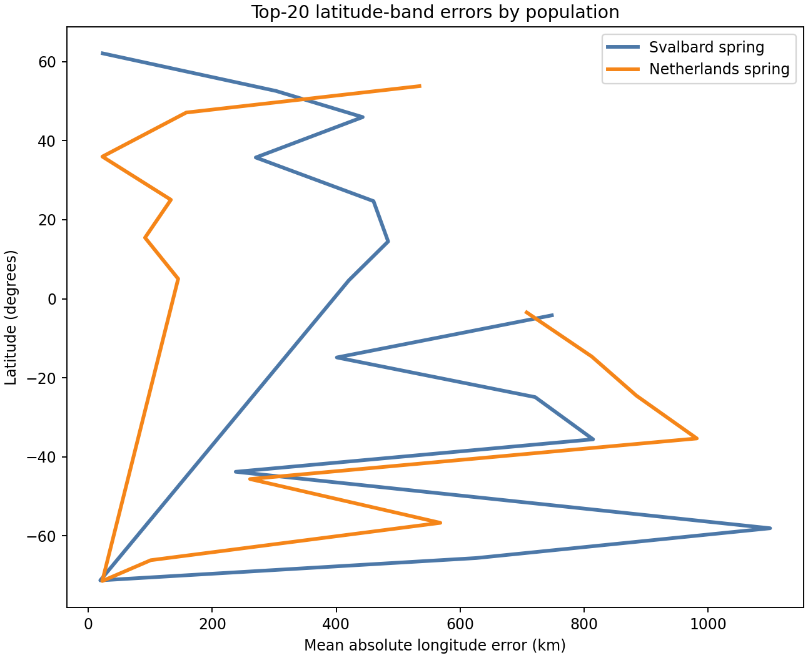

# Compare Svalbard spring and Netherlands spring RMSE results

## Question
Do the Svalbard spring and Netherlands spring H3 route experiments favor similar or different behavioral weight structures when ranked by RMSE against their benchmark flyways?

## Inputs
- `results/tables/16_svalbard_full_bounded_rmse.csv`
- `results/tables/16_netherlands_full_bounded_rmse.csv`
- `results/tables/17_svalbard_top20_rmse_behaviors.csv`
- `results/tables/17_netherlands_top20_rmse_behaviors.csv`
- `results/tables/17_svalbard_top20_band_error_summary.csv`
- `results/tables/17_netherlands_top20_band_error_summary.csv`

## Outputs
- comparison summary table: `results/tables/18_svalbard_netherlands_comparison_summary.csv`
- best-RMSE figure: `results/figures/18_svalbard_netherlands_best_rmse.png`
- coefficient comparison figure: `results/figures/18_svalbard_netherlands_top20_coefficients.png`
- band-error comparison figure: `results/figures/18_svalbard_netherlands_band_errors.png`

## Quick-look figures

## Best-route comparison
- **Svalbard spring**
  - best behavior: **behavior_209**
  - best RMSE: **508.9 km**
  - weights: **(0.8, 0.0, 0.2, 0.0)**
- **Netherlands spring**
  - best behavior: **behavior_166**
  - best RMSE: **437.9 km**
  - weights: **(0.5, 0.0, 0.5, 0.0)**

## Top-20 coefficient comparison
- Svalbard top-20 median wind weight: **0.8**
- Netherlands top-20 median wind weight: **0.5**
- Svalbard top-20 median distance weight: **0.1**
- Netherlands top-20 median distance weight: **0.3**

## Interpretation
The two populations do not point to exactly the same coefficient regime. Svalbard spring is more strongly wind-dominant among its top-RMSE solutions, whereas Netherlands spring places relatively more weight on distance alongside wind.

That is already scientifically useful, because it suggests the H3 routing framework may be flexible enough to express population-specific movement regimes rather than collapsing to one generic optimum across cases.

The RMSE comparison also suggests that Netherlands spring is reproduced somewhat more closely under the current setup than Svalbard spring, at least by this latitude-binned benchmark metric. That does not automatically mean the Netherlands case is biologically simpler, but it does mean the current graph-plus-endpoint setup aligns more closely with that benchmark summary.

The latitude-band comparison figure should be used to see whether the two populations struggle in the same parts of the flyway or in different latitude zones. If the difficult bands differ, that points toward case-specific route mismatches rather than one uniform model defect.

## Efficiency note
This comparison uses saved outputs only. It does not rerun route sweeps, endpoint sensitivity experiments, or mixed-behavior batches.
