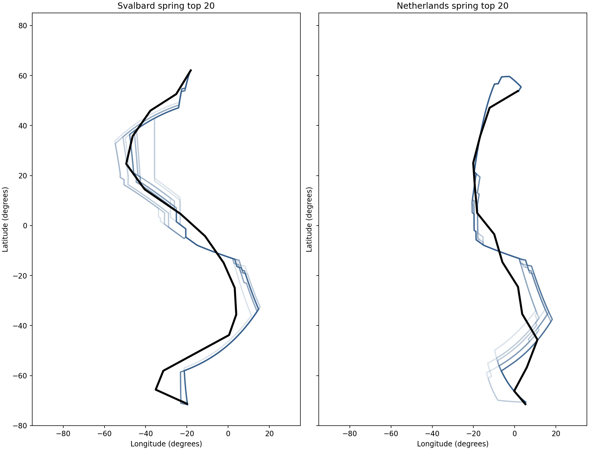
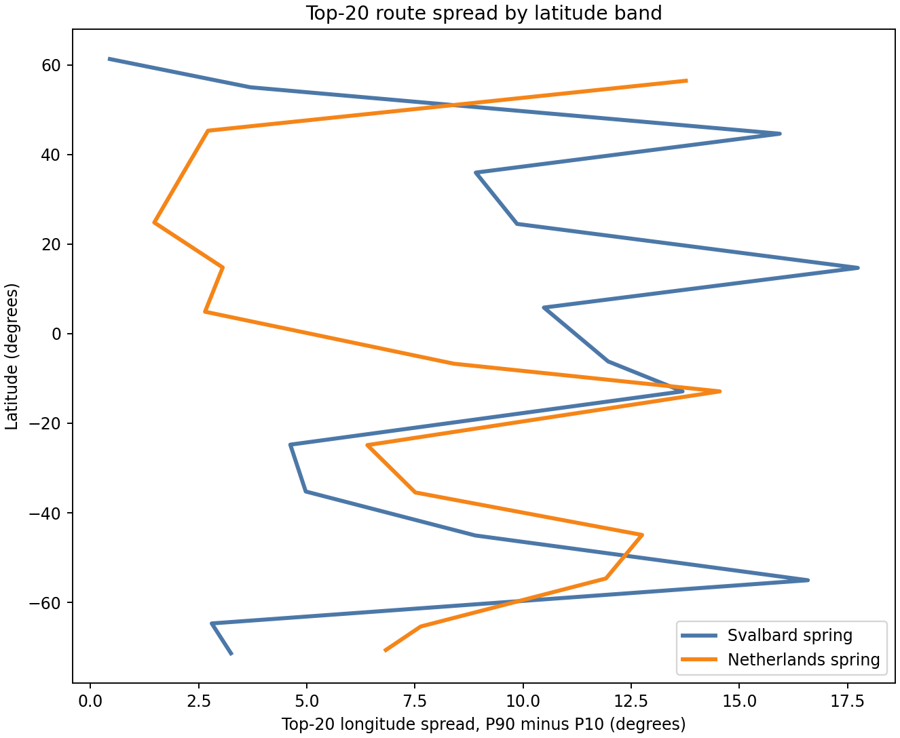
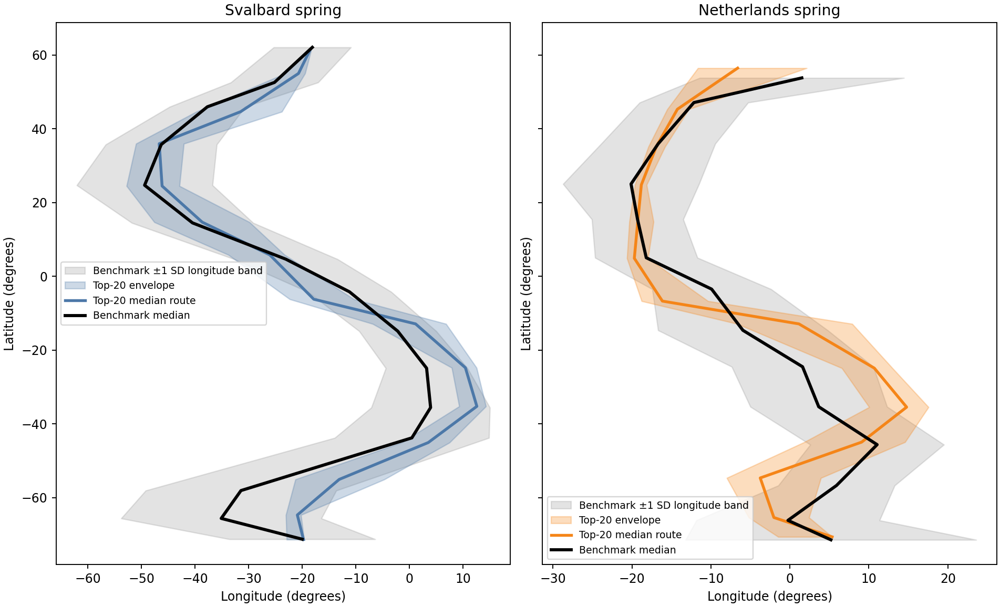

# Compare top-20 route structure, Svalbard spring versus Netherlands spring

## Question
How do the top 20 lowest-RMSE route families differ structurally between Svalbard spring and Netherlands spring?

## Inputs
- `results/tables/17_svalbard_top20_rmse_behaviors.csv`
- `results/tables/17_netherlands_top20_rmse_behaviors.csv`
- `results/tables/15_svalbard_full_bounded_dijkstra_paths.csv`
- `results/tables/15_netherlands_full_bounded_dijkstra_paths.csv`
- benchmark summaries `gdf_SS_10.csv` and `gdf_NS_10.csv`

## Outputs
- spread table: `results/tables/19_svalbard_netherlands_top20_route_spread.csv`
- overlay figure: `results/figures/19_svalbard_netherlands_top20_route_overlays.png`
- spread figure: `results/figures/19_svalbard_netherlands_top20_route_spread.png`
- benchmark-envelope figure: `results/figures/19_svalbard_netherlands_top20_benchmark_envelopes.png`

## Quick-look figures

## Main structural comparison
- mean top-20 longitude spread across latitude bands, **Svalbard spring**: **8.92 degrees**
- mean top-20 longitude spread across latitude bands, **Netherlands spring**: **7.27 degrees**
- widest Svalbard top-20 band: **(10, 20]** with spread **17.74 degrees**
- widest Netherlands top-20 band: **(-20, -10]** with spread **14.55 degrees**

## Interpretation
This step moves from coefficient comparison to route-family geometry. That matters because two populations can differ in top-ranked coefficients either because they genuinely prefer different movement regimes, or because their benchmark route geometries place different structural demands on the model.

The route-overlay figure shows whether the top 20 good solutions form a tight corridor or a broad family in each population. The spread-by-latitude figure then makes that explicit by showing where route uncertainty or flexibility is largest. The benchmark-envelope figure helps assess whether the benchmark line sits near the center of the good-solution family or closer to one side of the envelope.

To make that comparison more informative, the benchmark panel now also includes a **benchmark longitude dispersion band** built from the available `lon_sd_10` column in the benchmark summaries. This is a descriptive ±1 SD longitude ribbon around the benchmark median line for each 10° latitude band. It should not be interpreted as a confidence interval or percentile envelope, but it is still useful for showing whether the model top-20 envelope is narrower than, wider than, or offset from the benchmark's within-band dispersion.

If one population has a much wider top-20 envelope, that suggests the benchmark metric tolerates a broader family of good solutions there. If the envelope is tight, the benchmark is selecting a more specific route geometry. That distinction helps explain why different coefficient structures can survive among the top RMSE solutions.

## Efficiency note
This comparison uses saved top-20 route outputs only and does not rerun route simulations.
